# Memoria del TFM — Plataforma de comunicación con periféricos sobre MPSoC para OBC espaciales

> Documento de trabajo: volcado íntegro y reorganizado en Markdown de la memoria del TFM de Jorge A. Estefanía Hidalgo (proyecto LINCE), a partir de las fuentes LaTeX en `capitulos/` y `pre/`. Las imágenes se referencian con la misma ruta relativa que en el `.tex` (`IMG/...`), así que este fichero debe permanecer en `plantilla_tft_etsit/` para que los enlaces resuelvan. Los diagramas generados en TikZ/pgfplots (sin fichero de imagen propio) se señalan como tales, con la referencia al `.tex` de origen en vez de reproducir el código fuente completo.

---

## Resumen

Este Trabajo de Fin de Máster presenta el desarrollo de una plataforma de comunicación con
periféricos sobre el MPSoC Zynq UltraScale+ ZCU102, en el marco del proyecto LINCE, una
iniciativa del PERTE Aeroespacial liderada por Indra para el desarrollo de microsatélites de
órbita baja.

El trabajo abarca cinco áreas principales:

1. Diseño e implementación en VHDL de un transceptor serie altamente configurable para la lógica programable del MPSoC.
2. Desarrollo de un driver serie en C sobre RTEMS en el sistema de procesamiento del MPSoC, que usa el transceptor y ofrece una API pública que abstrae completamente del hardware.
3. Diseño y fabricación de tres PCB de ampliación de la ZCU102: la placa de comunicación serie (RS422/RS485), y las placas CDHS y AOCS del ordenador de a bordo del satélite (RS422/RS485, CAN, PWM, señales analógicas, SpaceWire).
4. Estudio del transporte de datos entre el sistema de procesamiento y la lógica programable: tres arquitecturas (AXI GPIO, DMA por transceptor, MCDMA con puente VHDL), comparadas y con selección de la mejor.
5. Validación de la plataforma con herramientas de software y hardware adicionales.

El conjunto constituye una plataforma funcional y validada que Sener, Indra y el B105 Electronic Systems Lab pueden usar como base para el subsistema de comunicaciones del OBC del satélite LINCE.

**Palabras clave:** MPSoC, FPGA, VHDL, RTEMS, RS422, RS485, CAN, SpaceWire, driver serie, PCB, AXI, DMA, MCDMA, AXI-Stream, sistemas empotrados, tiempo real, satélite, ordenador de a bordo.

---

## Agradecimientos

A Dani, tutor del TFM, por su actitud activa y ayuda constante. A Diego, compañero de ZCU102. Al equipo de Sener, especialmente Alba. A Álvaro, por la oportunidad de participar en LINCE y sus consejos. Al resto de compañeros del laboratorio B105. A los compañeros de carrera. Cierre de etapa habiendo trabajado en un satélite real.

---

## Lista de acrónimos y glosario

Términos ingleses sin traducción asentada en español se escriben en cursiva en el original; los ya incorporados al uso técnico habitual (hardware, software, driver, firmware) en redonda.

| Acrónimo | Significado |
|---|---|
| AOCS | Attitude and Orbit Control Subsystem — Subsistema de control de actitud y órbita |
| ADC | Analog-to-Digital Converter |
| AMBA | Advanced Microcontroller Bus Architecture (familia ARM) |
| API | Application Programming Interface |
| ARM | Advanced RISC Machines |
| AXI | Advanced eXtensible Interface (bus AMBA) |
| BD | Buffer Descriptor — descriptor de buffer en DMA scatter-gather |
| BER | Bit Error Rate |
| BIF | Boot Image Format |
| BRAM | Block RAM |
| BSP | Board Support Package |
| BOM | Bill of Materials |
| CAN | Controller Area Network |
| CDHS | Command and Data Handling System |
| CMRR | Common Mode Rejection Ratio |
| COTS | Commercial Off-The-Shelf |
| CRC | Cyclic Redundancy Check |
| CPU | Central Processing Unit |
| DDR | Double Data Rate (memoria) |
| DMA | Direct Memory Access |
| DSP | Digital Signal Processor |
| DTB | Device Tree Binary |
| EMC / EMI | Electromagnetic Compatibility / Interference |
| ESD | Electrostatic Discharge |
| ESA | European Space Agency |
| ETSIT | Escuela Técnica Superior de Ingenieros de Telecomunicación |
| FIFO | First In, First Out |
| FMC | FPGA Mezzanine Card (VITA 57.1) |
| FPGA | Field Programmable Gate Array |
| FSM | Finite State Machine |
| FSBL | First Stage Boot Loader |
| GPIO | General Purpose Input/Output |
| GUI | Graphical User Interface |
| HDL | Hardware Description Language |
| HP | High Performance (puertos AXI PS-PL) |
| HPC | High Pin Count (conector FMC) |
| IDE | Integrated Development Environment |
| INTC | Interrupt Controller |
| IRQ | Interrupt Request |
| ISR | Interrupt Service Routine |
| LDO | Low-Dropout Regulator |
| LEO | Low Earth Orbit |
| LINCE | Línea de INdustrialización de Cargas de pago y plataformas Espaciales |
| LVDS | Low-Voltage Differential Signaling |
| LUT | Look-Up Table |
| LSB / MSB | Least/Most Significant Bit |
| MCDMA | Multichannel DMA (IP `axi_mcdma`, PG288) |
| MMIO | Memory-Mapped I/O |
| MM2S / S2MM | Memory-Mapped to Stream / Stream to Memory-Mapped (canales DMA) |
| MMU | Memory Management Unit |
| MPSoC | Multiprocessor System-on-Chip |
| NCO | Numerically Controlled Oscillator |
| OBC | On-Board Computer |
| PCB | Printed Circuit Board |
| PERTE | Proyecto Estratégico para la Recuperación y Transformación Económica |
| PL | Programmable Logic |
| PMUFW | Power Management Unit Firmware |
| PS | Processing System |
| PWM | Pulse Width Modulation |
| QEMU | Quick Emulator |
| RSB | RTEMS Source Builder |
| RTEMS | Real-Time Executive for Multiprocessor Systems |
| RTL | Register Transfer Level |
| RTOS | Real-Time Operating System |
| SAR | Successive Approximation Register (ADC) |
| SEU | Single Event Upset |
| SG | Scatter-Gather |
| SLO | Pin del LTC2865 que habilita el limitador de slew rate, activo a nivel bajo |
| SMD | Surface Mount Device |
| SMP | Symmetric Multiprocessing |
| SPI | Serial Peripheral Interface |
| SPW | Abreviatura de SpaceWire |
| TCL | Tool Command Language (Vivado) |
| TDEST | Transfer Destination (AXI-Stream) |
| TFM | Trabajo Fin de Máster |
| TLAST | Transfer Last (AXI-Stream) |
| TMR | Triple Modular Redundancy |
| TREADY / TVALID | Señales de handshake AXI-Stream |
| TVS | Transient Voltage Suppressor |
| UART | Universal Asynchronous Receiver-Transmitter |
| UPM | Universidad Politécnica de Madrid |
| USB | Universal Serial Bus |
| VADJ | Carril ajustable de alimentación FMC de la ZCU102 (1,8 V en este trabajo) |
| VHDL | Very High Speed IC Hardware Description Language |
| VIO | Tensión de alimentación del banco de E/S digital de un IC |
| WNS | Worst Negative Slack |
| XSA | Xilinx Support Archive |

---

# Capítulo 1 — Introducción y objetivos

## 1.1 Introducción y motivación

Trabajo enmarcado en el proyecto **LINCE** (Línea de INdustrialización de Cargas de pago y
plataformas Espaciales), iniciativa del PERTE Aeroespacial liderada por Indra, para
microsatélites (100–200 kg) de órbita baja (LEO), con constelación demostradora STARTICAL.

Sener participa como socio tecnológico (firmware del OBC) y traslada los requisitos técnicos de
Indra. La UPM participa vía el grupo **B105 Electronic Systems Lab**, responsable del subsistema
de comunicaciones del OBC — ámbito de este trabajo. Enfoque **NewSpace**: componentes comerciales
(COTS) en vez de resistentes a radiación (mucho más caros); los efectos de la radiación se mitigan
con redundancia.

El OBC se comunica con los periféricos (propulsores, cámaras, seguidores de estrellas, sensores
térmicos) por enlaces serie. LINCE exige **catorce enlaces RS422/RS485 simultáneos**, cada uno con
sus parámetros propios. El reparto de recursos debe minimizar área en PL y uso de CPU en PS sin
penalizar rendimiento. La ZCU102 no tiene tantos transceptores físicos ni los conectores del
satélite: el propio banco de ensayo es parte del problema.

El autor entró en el B105 como becario por interés en proyectos espaciales; empezó en firmware
VHDL/C para RS422/RS485 sobre ZCU102, y la necesidad de condiciones eléctricas reales amplió el
alcance al diseño y fabricación del hardware del banco.

## 1.2 Objetivos

Objetivo principal: plataforma funcional y validada de comunicación con periféricos serie sobre el
MPSoC ZCU102, base para el OBC de LINCE. Objetivos específicos:

1. **Transceptor serie VHDL configurable** (RS422/RS485), parámetros en tiempo de ejecución:
   baudrate, paridad, bits de datos, bits de parada, orden de bit, limitación de slew rate. 14
   transceptores simultáneos (requisito LINCE).
2. **Arquitectura de transporte de datos PL↔PS**: investigar alternativas, implementarlas,
   compararlas y elegir la que mejor escale en rendimiento, área de PL y CPU.
3. **Driver de software completo en C para RTEMS 7**, API pública sencilla.
4. **Placa de comunicación serie** para ejercitar los 14 transceptores en topologías realistas
   (punto a punto o multipunto).
5. **Dos PCB de expansión de la ZCU102** (CDHS y AOCS) bajo especificación de los subsistemas del
   satélite: RS422/RS485, SpaceWire, CAN, PWM, medida de señales analógicas.
6. **Integrar y validar el sistema completo**: comunicación ZCU102 ↔ tres placas, funciones sin
   errores.


## 1.3 Metodología

Contacto estrecho con Sener; metodología ágil con Jira y tablero Kanban. Sprints de 2 semanas, 20
en total (paradas de Navidad y Semana Santa fuera de ciclo). Cada sprint cierra con revisión,
preparación del siguiente, mejoras de proceso y preguntas.


Automatizaciones propias en shell, Python y TCL redujeron tareas repetitivas y errores manuales.

**Planificación temporal**, tres fases:

- **Fase 1 (oct–ene): familiarización y entorno.** Instalación/configuración Vivado y Vitis,
  compilación de RTEMS 7 para AArch64 con RTEMS Source Builder, validación del flujo completo
  (Vivado → Vitis → RTEMS en ZCU102) con ejemplo funcional de extremo a extremo.
- **Fase 2 (feb–mediados jun): desarrollo e integración.** Transceptor VHDL, driver RTEMS, PCB
  serie/CDHS/AOCS, apps de prueba. Metodología iterativa: implementar → validar aislado → integrar.
  En firmware, testbenches por bloque y simulaciones de sistema completo. En hardware, detección de
  errores de diseño asumida como parte del proceso (caracterizar → corregir → refabricar cuando el
  calendario lo permitía). Validación de SpaceWire en la PCB AOCS quedó fuera de alcance.
- **Fase 3 (fin jun–jul): estudio del transporte y caracterización.** La caracterización reveló que
  el transporte de partida no era eficiente; se desarrollaron dos alternativas (AXI DMA por canal,
  y AXI MCDMA con puente VHDL), implementadas y comparadas.

## 1.4 Estructura de la memoria y documentación

Todo el trabajo (VHDL, apps y drivers RTEMS, bancos de pruebas, diseños de placas, scripts) está
versionado en un repositorio Git público (`repo_tfm`), bajo `tfm/`, organizado por bloques:
`01_ip_serie`, `02_transporte`, `03_bench_loopback`, `04_pcb_caracterizacion`,
`05_aplicaciones_cdhs_aocs`, `06_firmware`, `07_tools`, `00_docs`.

Tipografía: términos ingleses sin traducción asentada en cursiva (*buffer*, *stream*, *frame*,
*slew rate*); ya incorporados al uso técnico (hardware, software, driver, firmware) en redonda.

Estructura: 5 capítulos + 3 anexos.

- **Cap. 2 — Marco teórico**: LINCE, MPSoC ZCU102, Vivado/Vitis, RTEMS, estándares (RS422, RS485,
  SpaceWire, CAN), transporte PS↔PL (AXI, DMA).
- **Cap. 3 — Desarrollo del firmware**: entorno y flujo de compilación, transceptor VHDL, driver
  RTEMS 7, tres arquitecturas de transporte.
- **Cap. 4 — Hardware**: selección de componentes bajo restricción 1,8 V, reglas de diseño,
  fabricación de las tres PCB, banco de validación (apps de prueba, arneses).
- **Cap. 5 — Resultados**: validación CDHS y AOCS por interfaz, caracterización eléctrica de la
  placa serie (14 transceptores simultáneos), comparativa cuantitativa de las 3 arquitecturas.
- **Cap. 6 — Conclusiones y líneas futuras.**
- **Anexo A**: aspectos éticos, económicos, sociales y ambientales.
- **Anexo B**: presupuesto económico.
- **Anexo C**: mapas de señales de las tres placas, tabla del NCO, recuento de código, RTL de
  bloques auxiliares, app de testing del driver serie, ejemplo completo de la puerta AND, volcados
  de terminal de las pruebas de validación.

---

# Capítulo 2 — Marco teórico

## 2.1 Proyecto LINCE

Iniciativa del PERTE Aeroespacial, liderada por Indra, para consolidar capacidad industrial
española en microsatélites (100–200 kg) LEO. Ecosistema con grandes empresas, PYMES y centros de
investigación (UPM), para telecomunicaciones, vigilancia y observación, con autonomía estratégica
como objetivo.

## 2.2 MPSoC Zynq UltraScale+ ZCU102

Tarjeta de evaluación de AMD (antes Xilinx) para el MPSoC Zynq UltraScale+: 4 núcleos ARM + matriz
de lógica programable, unidos por buses AXI de alto rendimiento. Dos dominios:

- **PS (Processing System)**: núcleos ARM, ejecución secuencial clásica; sistema operativo, DDR,
  control de alto nivel.
- **PL (Programmable Logic)**: FPGA reconfigurable, se describe en VHDL; determinismo temporal
  estricto y paralelismo masivo, a cambio de un flujo de diseño más costoso.

Dos conectores FMC HPC (VITA 57.1) exponen pines digitales/pares diferenciales de la FPGA para
tarjetas de expansión (mezzanines).

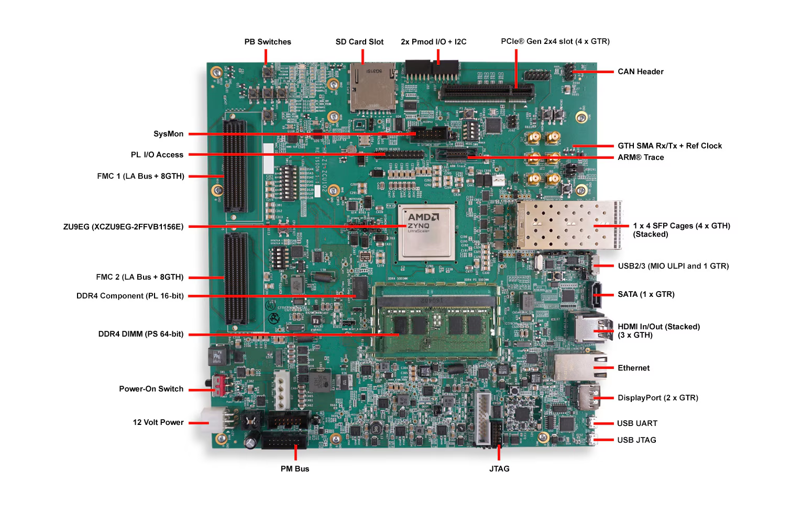


## 2.3 Vivado y Vitis (AMD)

- **Vivado Design Suite**: diseño, síntesis e implementación de la PL. HDL o Block Design (bus
  AXI); ficheros de restricciones `.xdc`; salidas: *bitstream* + `.xsa`.
- **Vitis Unified Software Platform**: IDE del software del PS. Toma el `.xsa`, genera el BSP
  (mapa de memoria + drivers de bajo nivel), compilador cruzado ARM, empaquetado de `BOOT.BIN`
  (PMUFW + FSBL + bitstream + ejecutable).

## 2.4 RTEMS

RTOS de código abierto de tiempo real para sistemas empotrados de misión crítica. Sin memoria
virtual: un espacio de direcciones físico, un proceso, varios hilos → baja latencia de interrupción.
Estándar de facto en industria aeroespacial (ESA, NASA). Sobre el PS, gestiona lógica de control y
acceso a registros de periféricos de la PL; sin driver previo para periféricos propios (control
total, mayor curva de aprendizaje).

## 2.5 Comunicaciones serie

Medio habitual OBC↔periféricos. Frente a bus paralelo: menos líneas físicas → menos peso/volumen de
arnés. Señalización diferencial cancela ruido de modo común.

### RS485
TIA/EIA-485: topología multipunto (hasta 32 transceptores estándar, más si carga fraccional).
Tensión diferencial A/B, alto CMRR. Half-duplex habitual sobre 2 hilos (control de dirección por
software). Hasta ~1200 m a baja velocidad o decenas de Mbps en distancias cortas; terminación
120 Ω en extremos.

### RS422
TIA/EIA-422: señalización diferencial, topología punto a punto o multi-drop, 1 transmisor y hasta
10 receptores. Full-duplex continuo con 4 hilos (TX y RX separados), sin arbitraje de bus.


### SpaceWire
Estándar de red a bordo de alta velocidad (ESA), para nodos de alto rendimiento. Señalización LVDS
y codificación *Data-Strobe* (DS): *Data* lleva el flujo, *Strobe* conmuta solo cuando el bit
repite al anterior → exactamente una transición por período de bit entre ambas líneas → reloj
recuperado por XOR, sin alineamiento estricto, tolerante al *skew*. Enlaces punto a punto
full-duplex asíncronos hasta 400 Mbps, con capa de red y *routers* SpaceWire.


### CAN
Nacido en automoción, estándar de facto (CAN for Aerospace) en TM/TC de satélites pequeños.
Multipunto y multimaestro, acceso por escucha de portadora, arbitraje por prioridad de mensaje bit
a bit sin destruir datos (gana el ID de mayor prioridad). CRC, bit stuffing, aislamiento automático
de nodos defectuosos.

## 2.6 Transporte de datos entre el PS y la PL

El mecanismo de intercambio de bytes PS↔PL condiciona carga de CPU, latencia y área en FPGA.

### Bus AXI (AMBA AXI4, ARM)

- **AXI4-Lite**: registros individuales, 5 canales, una palabra por transacción (una instrucción de
  carga/almacenamiento por palabra). Bus de configuración.

  

- **AXI4 full (memory-mapped)**: mismos 5 canales, ráfagas de hasta 256 transferencias. Bus de
  maestros de la PL hacia la DDR vía puertos HP, sin pasar por la CPU.

  

- **AXI4-Stream**: sin direcciones, un único canal de datos + handshake (TVALID/TREADY), TLAST,
  TDEST opcional. Ideal para UART y periféricos que producen/consumen bytes en secuencia.

  

### Acceso directo a memoria (DMA)

Maestro de bus que transfiere bloques memoria↔periférico sin intervención de CPU: el procesador
programa la transferencia y recibe una interrupción al terminar el bloque completo → la tasa de
interrupción pasa a depender de paquetes, no de bytes (2–3 órdenes de magnitud menos).


- **AXI DMA (PG021)**: traduce AXI4-Stream ↔ AXI4 *memory-mapped*, dos canales independientes
  (MM2S lee DDR y emite stream; S2MM recibe stream y escribe DDR, fin de paquete por TLAST). Modo
  directo (una transferencia) o *scatter-gather* (lista enlazada de descriptores BD, autónomo).
  Limitación: **sirve a un único stream** → N periféricos = N instancias.
- **AXI MCDMA (PG288)**: controlador **multicanal**, multiplexa hasta 16 canales lógicos sobre un
  único motor y puerto a memoria, cada canal con sus propios registros/anillo de descriptores/buffer
  DDR. El reparto entre canales lo hace **TDEST** del AXI-Stream (en recepción, decide el buffer
  destino; en transmisión, etiqueta el paquete con el canal de origen).

  

### Coste de la interrupción (*interrupt livelock*)

Lo que separa una vía de otra no es el ancho de banda, sino **cuántas veces se interrumpe al
procesador**: coste casi constante (~µs) por interrupción, independiente de los bytes. Si se
interrumpe una vez por byte, el sistema sigue el ritmo del enlace solo si el coste de interrupción
$C$ es menor que el tiempo de llegada de un byte $T_b$; al subir la velocidad, $T_b$ baja y $C$ no
→ umbral de saturación. Con $N$ enlaces simultáneos, el umbral llega $N$ veces antes. Mogul y
Ramakrishnan (1997) llamaron a este régimen **interrupt livelock**: por encima de cierta tasa, toda
la CPU se va en interrupciones y el rendimiento útil cae. Mitigación parcial: *deferred interrupt
processing*. Solución de fondo: interrumpir por paquete, no por byte → DMA.

---

# Capítulo 3 — Desarrollo del firmware

## 3.1 Preparación del entorno de desarrollo

Máquina virtual Linux (Ubuntu/Debian) como entorno principal (compilaciones prolongadas, más
recursos disponibles).

- **Vivado y Vitis 2025.1** (versión mantenida todo el trabajo).
- **RTEMS 7** compilado desde código fuente (no binarios precompilados) con la guía *Quick Start*
  y el RTEMS Source Builder (RSB): toolchain cruzado AArch64, BSP `zynqmp_apu` de la ZCU102, SMP
  habilitado explícitamente. Validado sobre QEMU (`qemu-system-aarch64`, máquina `xlnx-zcu102`) con
  `hello.exe` y `dhrystone.exe`.

### Validación del flujo de extremo a extremo (§1.3.3 original)

Ejemplo más pequeño posible antes del transceptor: **puerta AND** en VHDL sintetizada en PL,
programa RTEMS en PS que excita entradas, lee salida por AXI e imprime por consola serie.

Camino: dejar dos ficheros en la SD — **imagen de arranque** (bitstream + software de arranque,
Vivado+Vitis) e **imagen de la aplicación** (RTEMS). Procedimiento paso a paso completo →
Anexo C, apartado "Flujo de desarrollo de extremo a extremo: ejemplo de la puerta AND".

Resultado: barrido de tabla de verdad correcto (salida 1 solo con ambas entradas a 1). Detalle que
reaparece más adelante: RTEMS desconoce las direcciones de la PL — hay que declarar
`0xA0000000`–`0xA01FFFFF` como memoria de periférico al arrancar `Init` (si no, el primer acceso a
GPIO aborta). Resuelto como `mmu_map_pl_axi_early()`.

**Automatización del flujo.** Cada iteración manual: síntesis Vivado + plataforma/app Vitis nuevas +
imagen de arranque + imagen RTEMS + copiar a SD + arrancar: **casi una hora**. Vitis reutiliza
artefactos cacheados de forma poco fiable → regla adoptada: plataforma y aplicación nuevas ante
cualquier cambio en la PL. Herramientas desarrolladas (repositorio):

- `make_img.sh`: compila y empaqueta la app RTEMS.
- `automate_ymodem_update.py`: envía la imagen por el mismo USB de consola, sin extraer la SD.
- `generate_boot.sh`: automatiza la generación de la imagen de arranque completa (desde proyecto
  Vivado o desde diseño ya sintetizado).

## 3.2 Diseño del transceptor serie configurable (PL)

Objetivo: altamente configurable y adaptable a cualquier dispositivo final (desconocido a priori).

**Bloques fundamentales:**
- **NCO** (`NCO.vhd`): temporización de bit, 54 velocidades soportadas; TX y RX tienen cada uno el suyo.
- **Transmisor** (`TX_CONFIGURABLE_SERIAL.vhd`): serializa/emite tramas, gobierna *Driver Enable*.
- **Receptor** (`RX_CONFIGURABLE_SERIAL.vhd`): detecta inicio de trama, muestrea, comprueba paridad/parada.
- **Registro de desplazamiento** (`ShiftRegister.vhd`): a paralelo, normaliza orden/anchura.
- **FIFO**: 9 bits × 512 profundidad, almacena mensajes hasta lectura del PS.
- **Bloque de canal** (`CONFIGURABLE_SERIAL.vhd`): integra todo + lógica de acoplamiento.
- **Bloque top** (`CONFIGURABLE_SERIAL_TOP.vhd`): empaqueta el canal en dos vectores hacia el PS.

**Parámetros configurables:** baudrate (50–4.000.000), bits de parada (1, 1,5, 2), paridad (par,
impar, marca, espacio, deshabilitada), orden de bits (LSB/MSB), bits de datos (5–9).

### 3.2.1 NCO (Oscilador Controlado Numéricamente)

Divisor entero del reloj FPGA no genera con exactitud la mayoría de baudrates → NCO: sumador
acumulador de 32 bits; incremento tabulado por baudrate ($\mathrm{inc} = \lfloor 2^{32} \cdot
f_{baud}/f_{clk}\rfloor$, calculado en síntesis); overflow → `tick`. Tabla con incremento nominal y
de doble frecuencia (`half_mode`, usado por TX en campo de parada y por RX en bit de inicio, evita
duplicar error de truncamiento). `rst` realinea fase; `en` congela el acumulador entre tramas.

Verificado con `tb_NCO.vhd` (`tfm/01_ip_serie/testbench/`): 29 velocidades del rango de uso
(9.600–3,6864 Mbaudios) × 2 modos = 58 medidas, promediando 200 períodos tras descartar 10.

```
---- Configuracion: 9600 half=0 baud=9600 ----
CFG=9600 expected=9600.0 Hz  measured=9600.002000 Hz  err=0.002000 Hz (0.2 ppm)
---- Configuracion: 9600 half=1 baud=9600 ----
CFG=9600 expected=19200.0 Hz  measured=19200.004000 Hz  err=0.004000 Hz (0.2 ppm)
...
---- Configuracion: 3686400 half=0 baud=3686400 ----
CFG=3686400 expected=3686400.0 Hz  measured=3685956.506000 Hz  err=-443.494000 Hz (-120.3 ppm)
---- Configuracion: 3686400 half=1 baud=3686400 ----
CFG=3686400 expected=7372800.0 Hz  measured=7371913.012000 Hz  err=-886.988000 Hz (-120.3 ppm)
Fin del testbench: medidas completadas para todas las frecuencias.
```

Peor error: 120 ppm a 3,6864 Mbaudios (dos órdenes de magnitud por debajo de la tolerancia habitual
±2 % de un UART); nulo o <1 ppm en la mayoría de velocidades estándar. Tabla completa de 29
entradas → Anexo C (`tab:nco`).

### 3.2.2 Transmisor

Puertos: `Clk`, `Reset`, `Start`, `Data` (9 bits), `baud_sel` (6 bits), `stop_bit`, `parity`,
`bit_order`, `data_bits`, `EOT` (out), `DE` (out), `TX` (out). Genérico `DELAY_CYCLES`.

**FSM de 7 estados:** `Idle` → `PreDE` (activa DE, espera `DELAY_CYCLES` ciclos, resetea NCO) →
`StartBit` (línea a 0 un tiempo de bit) → `SendData` (serializa, avanza contador) → `ParityBit` (si
aplica) → `StopBit` (NCO en `half_mode`, cuenta semiperíodos: 2/3/4 según 1/1,5/2 bits) → `PostDE`
(simétrico de PreDE) → `Idle`.

**Lógica de apoyo:** banco de contadores (bits de datos 4b, semiperíodos parada 3b, retardo DE 14b);
decodificador de anchura de palabra; multiplexor de serialización (LSB directo, MSB con 5
multiplexores por anchura + selector); generador de paridad (red XOR + mux de modo); reset del NCO
combinado con reset global.

**Retardo de establecimiento del Driver Enable** (`PreDE`/`PostDE`): incorporado tras observar
caracteres corruptos ocasionales en CDHS — hipótesis: DE conmutaba demasiado rápido. Valor por
defecto: 10.000 ciclos = 100 µs a 100 MHz (reducido en simulación). No eliminó los caracteres
corruptos (causa real: receptor, ver más abajo), pero se mantuvo por ser coherente con tiempos de
habilitación de los transceptores.

### 3.2.3 Receptor

Puertos: mismas 5 entradas de configuración que TX; `LineRD_in`, `shiftRegister_Q`, `ERROR_OK` (in);
`PAR_ERROR`, `FRAME_ERROR`, `Valid_out`, `Code_out`, `Store_out` (out).

**FSM de 5 estados:** `Idle` (nivel bajo → posible inicio, resetea NCO, ancla fase) → `StartBit`
(NCO en `half_mode`, primer tick a mitad del bit de inicio: si sigue en bajo, válido → `RcvData`; si
no, descarta → `Idle`) → `RcvData` (cada tick a velocidad nominal, captura y `Valid_out`; fase
arrancó a mitad del bit de inicio → todos los ticks caen en el centro del bit) → `ParityBit`
(compara; si falla, `PAR_ERROR` y descarta) → `StopBit` (muestra centro del primer bit de parada;
`Store_out` si alto, `FRAME_ERROR` si bajo) → `Idle`. Solo se comprueba el primer bit de parada.

**Verificación del bit de inicio a mitad de período**: filtra falsos inicios por ruido — si el pulso
es más corto que medio bit, la línea vuelve a alto antes del tick y se descarta sin capturar basura.
Esta técnica **resolvió los caracteres corruptos** observados en CDHS.

**Cronograma de una trama completa** (figura con TikZ, no imagen de archivo — fuente en
`capitulos/cap3/entorno_desarrollo.tex`, entorno `figure` de la etiqueta `fig:cronograma_trama`):
configuración 8E1 LSB-first, dato `0x53`; muestra ventana de DE, ticks de TX (uno por frontera de
bit, doble frecuencia en parada) e instantes de muestreo de RX (centro de cada bit, el primero en el
centro del bit de inicio). Zonas `PreDE`/`PostDE` no a escala (100 µs frente a 8,7 µs de tiempo de
bit a 115.200 baudios).

### 3.2.4 Normalización y almacenamiento

Registro de desplazamiento **normaliza**: el primer bit recibido siempre acaba en `Q(0)`,
independientemente de anchura/orden configurados → FIFO y cálculo de paridad esperada ignoran la
configuración. FIFO IP: 9 bits × 512, habilitación de lectura **a nivel** (no por flanco) — condición
necesaria para el transporte por DMA (con lectura a nivel, la FIFO avanza exactamente en el ciclo en
que el consumidor acepta el dato). RTL detallado → Anexo C.

### 3.2.5 Bloque de canal

`CONFIGURABLE_SERIAL.vhd` integra TX+RX+ShiftRegister+FIFO y añade: registro de la línea RX (1
ciclo, anti-metaestabilidad), detección de flanco de mandos PS→PL (`TX_Send`, `Data_read`, dos
etapas), arranque de transmisión (Start solo si EOT activo, captura de dato en registro propio),
adaptación del campo de parada (2 bits PS ↔ 3 bits semiperíodo internos), vector de depuración (4
bits, solo simulación).


### 3.2.6 Bloque top del transceptor

`CONFIGURABLE_SERIAL_TOP.vhd`: empaqueta el canal en dos vectores para conectar a un AXI GPIO de
doble canal.

**Vector de configuración/escritura (PS→PL), 28 bits:**

| Bits | Campo | Función |
|---|---|---|
| 8:0 | `Data_in` | Palabra a transmitir |
| 9 | `TX_Send` | Petición de transmisión |
| 10 | `ERROR_OK` | Reconocimiento de banderas de error |
| 11 | `Data_read` | Lectura de la FIFO de recepción |
| 17:12 | `baud_sel` | Índice de velocidad |
| 19:18 | `stop_bit` | Bits de parada |
| 22:20 | `parity` | Modo de paridad |
| 25:23 | `data_bits` | Número de bits de datos |
| 26 | `bit_order` | Orden de bits |
| 27 | `SLO` | Control del limitador de slew rate físico |

**Vector de estado/lectura (PL→PS), 14 bits:**

| Bits | Campo | Función |
|---|---|---|
| 8:0 | `Data_out` | Palabra recibida |
| 9 | `Empty` | FIFO de recepción vacía |
| 10 | `Full` | FIFO de recepción llena |
| 11 | `PAR_ERROR` | Error de paridad |
| 12 | `FRAME_ERROR` | Error de trama |
| 13 | `TX_RDY` | Transmisor libre |

`SLO` viaja directo del bit 27 al pin del transceptor físico, sin lógica intermedia. Salida
auxiliar de 2 bits (duplica `TX_RDY`/`Empty`) va al controlador de interrupciones.

**Envoltorios de nivel superior** (uno por arquitectura de transporte, mismo canal reutilizado):
- `MULTI_SERIAL_CORE.vhd`: hasta 14 instancias en un IP, interfaces aplanadas (arquitectura GPIO).
- `SERIAL_CHANNEL_IP.vhd`: un canal como IP independiente para Block Design.
- `UART_AXIS_TOP.vhd`: registro AXI-Lite + 2 canales AXI-Stream (TDEST=canal, TLAST por byte), para
  conectar a un controlador DMA.

### 3.2.7 Verificación en simulación del canal completo

`tb_CONFIGURABLE_SERIAL_TOP.vhd` (`tfm/01_ip_serie/testbench/`): TX conectado a su propio RD.
Barrido completo a 921.600 baudios: 5 anchuras × 2 órdenes × 3 parada × 5 paridad = **150
configuraciones** × 3 tramas = **450 tramas** comparadas dato a dato.

```
==== TB START: TX->RX loopback tests ====
PASS cfg bits=5 order='0' stop=1 par=0 sent=11 rec=11
...
PASS cfg bits=9 order='1' stop=3 par=4 sent=134 rec=134
==== TESTS FINISHED ====
Passed = 450 / Total = 450
```

Ninguna disparó `PAR_ERROR`/`FRAME_ERROR`. Confirma coincidencia TX/RX en todos los bloques y todas
las combinaciones programables.

### 3.2.8 Bloque Zynq UltraScale+ MPSoC

Aplicar el *preset* al IP antes de añadir el resto de elementos (configura relojes/alimentación
críticos).

## 3.3 Herramientas de apoyo al desarrollo del transceptor

- `new_generate_transceivers.tcl`: genera y conecta N transceptores en el Block Design (AXI GPIO
  doble canal por transceptor, INTC común, bloque de metadatos de solo lectura, direcciones).
- `new_rebuild_all.tcl`: regenera el proyecto Vivado completo desde cero con N transceptores (crea
  proyecto ZCU102, fuentes, restricciones, bloque Zynq, invoca al script anterior, valida, genera
  wrapper).

## 3.4 Diseño del driver serie en RTEMS (PS)

`transceiver.c`/`transceiver.h`: driver para RTEMS, habla con el AXI GPIO de cada canal, API
pública sencilla. **Prueba de concepto**: sin requisitos de optimización impuestos.

### 3.4.1 API pública

- `uint32_t Transceiver_Global_INIT(void)` — una vez al arranque: descubre canales, prepara INTC,
  instala ISR común, devuelve N.
- `rtems_status_code Transceiver_Init(dev, id, cfg)` — una vez por canal.
- `void Transceiver_SetRxCallback(dev, cb, arg)` — registra callback de recepción (libre, decide la
  app).
- `size_t Transceiver_Read(dev, buf, maxlen)` — extrae bytes ya recibidos, no bloquea.
- `int Transceiver_Send(dev, data, len)` — encola y retorna de inmediato.
- `int Transceiver_SendString(dev, s)` — igual, para cadenas.

### 3.4.2 Interfaz con el hardware

Un AXI GPIO doble canal por instancia, 4 KB mapeados. Canal 1 (28 bits, PS→PL) en offset `0x00`;
canal 2 (14 bits, PL→PS) en offset `0x08`.

| Escritura (PS→PL) bits | Campo | Lectura (PL→PS) bits | Campo |
|---|---|---|---|
| 8:0 | Dato a transmitir | 8:0 | Byte recibido |
| 9 | `SEND` | 9 | `RX_EMPTY` |
| 10 | `ERROR_OK` | 10 | `RX_FULL` |
| 11 | `DATA_READ` | 11 | `PARITY_ERROR` |
| 17:12 | Baudios | 12 | `FRAME_ERROR` |
| 19:18 | Bits de parada | 13 | `TX_RDY` |
| 22:20 | Paridad | | |
| 25:23 | Bits de datos | | |
| 26 | Orden de bits | | |
| 27 | `SLO` | | |

Bits de control como pulsos (SEND, DATA_READ, ERROR_OK). Configuración de protocolo se escribe una
vez en `Transceiver_Init()` y se preserva como base.

**Descubrimiento del mapa de direcciones**: ninguna dirección hardcodeada. Un AXI GPIO adicional de
solo lectura en `0xA0020000` publica: N (transceptores, canal 1 bits 15:0), *stride* (canal 1 bits
31:16, 4 KB), dirección base (canal 2). El driver deduce:
$\text{base}_i = \text{base} + i \cdot \text{stride}$, $\text{base}_{\text{INTC}} = \text{base} + N
\cdot \text{stride}$. Mismo binario RTEMS sirve para cualquier bitstream (1 a 14 canales).

**Bit SLO**: no actúa en VHDL, se propaga directo al pin del chip transceptor de la PCB (efecto
eléctrico cuantificado en la caracterización de la placa, §5.3).

### 3.4.3 Gestión interna de la transmisión

Buffer circular de 4 KB por canal. `Transceiver_Send()` copia ahí; si el transmisor estaba libre,
escribe el primer byte directo (no bloquea). Resto de la ráfaga: 14 canales comparten un único AXI
INTC (28 fuentes → 1 línea); `Master_ISR` atiende, localiza canal en `g_instances[]` por índice
directo, escribe siguiente byte al ver `TX_RDY`. Semáforo binario serializa llamadas concurrentes;
inhibición breve de interrupciones protege el buffer.

(Diagrama del camino de un byte PL↔PS: TikZ, sin imagen de archivo — fuente en
`capitulos/cap3/entorno_desarrollo.tex`, figura `fig:driver_camino_datos`.)

### 3.4.4 Gestión interna de la recepción

Patrón de procesado diferido: ISR hace lo mínimo, delega en tarea `Rx_Worker_Task` (una por canal,
creada en `Transceiver_Init()`). Al llegar un byte, `Master_ISR` inhibe la fuente en INTC y envía
evento RTEMS a la worker; esta vacía el FIFO hardware byte a byte hacia el buffer circular de
recepción (4 KB), confirmando con `DATA_READ`, invoca el callback, rehabilita interrupción, se
bloquea. Semáforo binario por canal protege el buffer. La copia corre como tarea planificable, no en
contexto de interrupción → la latencia de interrupción no depende del volumen de datos.

## 3.5 Arquitecturas de transporte PS–PL

El factor determinante del rendimiento con 14 canales activos no es el transceptor ni el driver
sino **el camino por el que viajan los bytes** entre DDR y PL. Se implementaron **tres
arquitecturas completas**, medidas con el mismo programa de pruebas.

| Variante | Transporte PS↔PL | Idea |
|---|---|---|
| A — GPIO | AXI-Lite / AXI GPIO | Un registro por canal; el PS mueve byte a byte |
| B — DMA14 | 14 × AXI DMA (PG021) | Un motor DMA completo por canal |
| C — MCDMA | 1 × AXI MCDMA (PG288) + puente VHDL | Un motor multicanal compartido |

### 3.5.1 Variante A — AXI GPIO (referencia)

La de partida (descrita arriba). Cada canal: `CONFIGURABLE_SERIAL_TOP` + AXI GPIO doble canal en un
smartconnect AXI-Lite. AXI INTC concentra 28 fuentes en una línea.

Virtud: simplicidad, menos lógica (**6.434 LUT**, 2,35 % del dispositivo, 460 LUT/canal), sin
mapeo MMU especial, sin coherencia de caché. Defecto estructural: **el procesador toca cada byte**
(interrupción por carácter en RX; ISR escribe byte a byte en TX).

Coste: **1.250 interrupciones/KB**. Throughput estancado ~30 % del techo físico, **no mejora al
subir velocidad** (115.200→4 Mbaudios: 3.471→4.907 B/s) — régimen de *interrupt livelock*.

### 3.5.2 Variante B — 14× AXI DMA

Saca a la CPU del movimiento de datos. `axi_dma` sirve a un único stream → 14 instancias.

**Adaptación UART→AXI-Stream**: `UART_AXIS_TOP.vhd` envuelve `CONFIGURABLE_SERIAL` con interfaz
AXI4-Stream esclava (TX) y maestra (RX, con TLAST).

**Operación**: modo directo (sin scatter-gather). TX: driver escribe dirección+longitud, ISR MM2S
libera semáforo al terminar. RX: canal S2MM armado con longitud 1, TLAST por byte cierra el paquete.

**Coste de replicar motores**: 3,8 IRQ/KB en TX (frente a 1.024 de GPIO en ese sentido). El límite
no es de rendimiento sino de recursos:
- **Lógica**: 14 motores completos = **40.217 LUT** (14,7 %), **2.873 LUT/canal** — >6× la huella
  de GPIO; condiciona endurecimiento futuro (TMR triplicaría → casi la mitad del dispositivo).
- **Interrupciones**: cada `axi_dma` expone 2 líneas (MM2S+S2MM) → 14 DMA = **28 líneas**, pero el
  PS solo ofrece 8 en `pl_ps_irq0`. Reducidas por OR a 2 → ISR pierde info de *qué* canal y escanea
  14 registros de estado.

**La recepción de esta variante no llegó a medirse**: el autodiagnóstico del banco de loopback la
señaló como abierta. Con el coste de lógica y el límite de líneas ya conocidos, se descartó sin
seguir depurando; esfuerzo redirigido a la variante MCDMA. Cifras de recepción: no disponibles;
válidas: coste de hardware, huella de memoria, IRQ de transmisión.

### 3.5.3 Variante C — AXI MCDMA con puente VHDL (solución final)

Un solo motor multicanal (`axi_mcdma`, PG288) + **puente en VHDL** propio (única variante con diseño
propio en lugar de solo IP de terceros).

Topología **asimétrica**: TX — 1 canal DMA (destino viaja en el propio dato); RX — 14 canales S2MM
(cada UART habla sin avisar, necesita buffer DDR propio).


**Camino de transmisión**: canal MM2S emite stream de 32 bits → conversor de anchura a 8. Cabecera
de 2 bytes: `{CH_ID[3:0], LEN[11:8]} | {LEN[7:0]} | payload...`. `BRIDGE_TX_TOP`: `TX_DMA_ROUTER`
(parsea cabecera) → `MUX_2x16` (demultiplexa) → 14× `TX_WORKER` (FIFO 8 bits FWFT + FSM
IDLE→START→BUSY, respeta handshake del UART). Un solo canal DMA sirve a los 14 transceptores;
transmisiones se serializan → `Transceiver_Send` **bloqueante** solo en esta variante (mutex).

**`TX_ISR_EOF_HANDLER`**: el DMA sabe cuándo entregó el paquete al puente, no cuándo el UART lo
emitió por el cobre — importante en RS485 con control de dirección. Bloque propio: registro *sticky*
+ una interrupción.

| Offset | Registro | Acceso | Función |
|---|---|---|---|
| `0x00` | `TX_DONE` | RO | Un bit por canal, se pone a 1 al fin de trama |
| `0x04` | `TX_DONE_CLEAR` | W1C | Escribir 1 borra el bit |
| `0x08` | `IRQ_ENABLE` | RW | Máscara de canales que generan interrupción |
| `0x0C` | `IRQ_STATUS` | RO | `TX_DONE AND IRQ_ENABLE` |

(base `0xA0001000`). Prioridad de "puesta a 1" sobre "borrado" para no perder eventos en carrera.

**Camino de recepción y TDEST**: `BRIDGE_RX_TOP` — FIFO por canal, DEMUX, bloque DRAIN (vacía FIFO
seleccionada, cierra con TLAST, fija TDEST=canal origen). El MCDMA demultiplexa por TDEST hacia el
descriptor/buffer del canal N. Sin etiqueta, todo cae en canal 0.


Cierre de paquete: FIFO vacía (fin natural) o tope duro `MAX_PKT` = 256 bytes (invariante de
seguridad, ver depuración más abajo).

**Mapa de memoria e interrupciones:**

| Dirección | Bloque | Tamaño |
|---|---|---|
| `0xA000_0000` | `AXI_UART_CONFIG` (1 registro 32b/canal) | 4 KB |
| `0xA000_1000` | `TX_ISR_EOF_HANDLER` | 4 KB |
| `0xA001_0000` | Registros de control del `axi_mcdma` | 64 KB |

Interrupciones: `mm2s_introut` (SPI 89, vector 121), `s2mm_introut` (SPI 90, vector 122), fin de
trama (SPI 91, vector 123). Las 14 salidas RX se reducen por OR a una sola.

**Descriptores scatter-gather**: MCDMA siempre en modo SG; driver construye BD en memoria (64 bytes
alineados). Anillo de 1 descriptor por canal, apunta a sí mismo.

| Offset | Campo | Contenido |
|---|---|---|
| `+0x00` | `NDESC` | Dirección del siguiente descriptor (él mismo) |
| `+0x08` | `BUFA` | Dirección del buffer de datos |
| `+0x14` | `CTRL` | SOF (bit 31), EOF (bit 30), longitud (bits 25:0) |
| `+0x18` | `STS` | RX: COMPLETE (bit 31) + bytes escritos |
| `+0x1C` | `SIDEBAND` | TX: COMPLETE (bit 31) |

**Coste**: **14.191 LUT** (5,18 %), **1.014 LUT/canal**, incluyendo el puente propio. Tres líneas de
interrupción (de 8 disponibles) → 5 libres para ampliaciones. Precio: serialización de TX
(mutex).

### 3.5.4 Comparación y elección de la arquitectura final

| Variante | IRQ/KB | LUT | LUT/canal | Líneas IRQ |
|---|---|---|---|---|
| A — GPIO | 1.250 | 6.434 | 460 | 1* |
| B — DMA14 | 3,8† | 40.217 | 2.873 | 28 |
| C — MCDMA | **3** | 14.191 | **1.014** | **3** |

\* Un AXI INTC reduce las 28 fuentes a una línea. † Solo TX, sin lazo de recepción, no comparable.
PS ofrece 8 líneas en `pl_ps_irq0`. Sobre 274.080 LUT del XCZU9EG.

GPIO descartado por CPU (livelock). Entre las dos con DMA: replicar 14 motores cuesta **2,8×** más
lógica que compartir uno, y esa distancia se triplica con TMR (DMA14 ≈ mitad del dispositivo).
28 líneas IRQ contra 8 disponibles → reducción por OR + escaneo; MCDMA cabe con holgura en 3.

**Se adopta MCDMA como solución final**, asumiendo la serialización de TX y el diseño/verificación
de lógica propia.

### 3.5.5 Verificación y depuración iterativa del driver

Metodología: (1) verificación aislada en simulación de cada bloque; (2) integración incremental con
comprobación en placa; (3) batería automática en placa (36 comprobaciones) como prueba de regresión.

Iteraciones directas resueltas: polling→interrupción (`c_enable_multi_intr`); propagación de TDEST
por toda la jerarquía (sin ella, todo el RX cae en canal 0).

**Parte más costosa: depuración del bus AXI-Stream contra el motor DMA.** Sin observabilidad desde
software (sin bit de estado, ni IRQ, ni descriptor marcado — el motor deja de aceptar datos y el
canal enmudece). Obligó a reproducir en simulación con contrapresión, tamaños variables, ráfagas
solapadas. Dos **invariantes estructurales** resultantes:

- **Tamaño de paquete acotado**: motor RX en modo *store-and-forward* (`c_include_s2mm_sf=1`),
  buffer interno de **512 bytes**; un paquete mayor lo bloquea esperando un TLAST que no llega.
  `DRAIN` impone `MAX_PKT=256` (mitad del buffer) además de cerrar por FIFO vacía — estructural, no
  dependiente de que el drenado gane siempre la carrera.
- **TLAST registrado**: no puede ser combinacional sobre "FIFO vacía" mientras hay dato ofrecido —
  un byte nuevo durante espera por contrapresión tumbaría el TLAST ya presentado. Se congela en
  cuanto el byte se ofrece.

`tb_bridge_rx.vhd`: canal aislado, 3 canales entremezclados, paquete de 256 bytes (cierre por
longitud), 2 ráfagas back-to-back. Scoreboard byte a byte.

```
-- Reset liberado --
T1: canal unico ch2 (3 bytes, timeout)
T2: multi-canal ch0/ch5/ch13 (1 byte c/u, timeout)
T3: 256 bytes ch1, prog_full auto-trigger
T4: back-to-back ch7 (2 eventos de timeout)
------------------------------------------------------------
Checks totales  : 802
Errores         : 0
Pendientes exp  : 0
------------------------------------------------------------
SIM_RESULT: PASS
```

`tb_system_e2e.vhd`: lazo completo MCDMA→puente TX→transceptor→realimentación→puente RX→MCDMA,
921.600 8N1.

```
[CONFIG] Escribiendo 921600 8N1 en canales 0 y 1...
[TEST-1] TX->CH0 loopback: 0xA5, 0x3C ...
[TEST-1] PASS
[TEST-2] TX->CH0(0xDE) y CH1(0xAD) simultaneo...
[TEST-2] PASS
[TEST-3] Inyeccion serie directa CH1 <- 0x55 ...
[TEST-3] PASS
SIM_RESULT: PASS
```

TEST-2 verifica demultiplexado TDEST con dos canales a la vez (era el síntoma "todo cae en canal 0"
en placa).

**Comprobación de flujo adicional**: el bloque puente+transceptores está como *module reference* y
Vivado cachea su checkpoint fuera de contexto — editar VHDL sin regenerar puede dejar el bitstream
antiguo sin avisar. Se incorporó verificar que el hash de `BOOT.BIN` cambia.

Resultado: **0/36 → 36/36** comprobaciones tras las correcciones; throughput sin pérdidas en 5
repeticiones de 5120 bytes; barrido de velocidad completo 115.200→4 Mbaudios.

### 3.5.6 Banco de pruebas de loopback en la PL

Comparar arquitecturas exige igualdad de condiciones — sobre PCB real influyen cableado, jumpers,
integridad física. **Buses cerrados dentro de la FPGA**: módulo de loopback reproduce la topología
de la PCB.

| Bus | Maestro | Esclavos |
|---|---|---|
| A (multipunto) | CH0 | CH1–CH6 |
| B | CH7 | CH8–CH10 |
| C | CH11 | CH12–CH13 |

Emulación fiel a RS485: reposo alto, wired-AND (RX de un canal = AND de TX de **los demás** de su
bus); **un canal no se oye a sí mismo** (como en PCB, RX inhibido durante control de dirección).
Los 3 buses aislados entre sí.

`tb_bench_loopback.v`, 16 puntos:

```
  ok  reposo rd = 1
  ok  rd[1] sigue a td[0] = 0
  ok  rd[6] sigue a td[0] = 0
  ok  rd[0] no se oye a si mismo = 1
  ok  rd[8] aislado del bus A = 1
  ok  rd[12] aislado del bus A = 1
  ok  bus A: rd[1] = 0
  ok  bus B: rd[8] = 0
  ok  bus C: rd[12] = 0
  ok  maestro A mudo a si mismo = 1
  ok  maestro B mudo a si mismo = 1
  ok  maestro C mudo a si mismo = 1
  ok  multidrop rd[1..6] todos a 0 = 0
  ok  respuesta: rd[0] oye a td[1] = 0
  ok  respuesta: rd[2] tambien la oye (multidrop) = 0
  ok  respuesta no cruza al bus B = 1

TB OK: 0 fallos
```

Se inserta en las tres variantes vía script TCL (desconecta la red RX física, la alimenta desde
loopback; TX sigue a los pines, constraints intactas).

`bench_main.c` (mismo programa en las 3 variantes), 8 pruebas: T0 autodiagnóstico del lazo, T1
latencia de un frame, T2 throughput de 1 canal, T3 TX concurrente de 3 maestros, T4 RX multipunto de
6 esclavos, T5 desbordamiento de buffer software, T6 barrido de velocidad 115.200→4 Mbaudios, T7
recuperación ante frames corruptos. Cronómetro siempre **en el receptor** (nunca al retornar del
envío: MCDMA es bloqueante, las otras dos no).

Con el lazo en la FPGA se mide exactamente el **coste del transporte PS–PL**, no la capa física
(reflexiones, terminación, tiempos de vuelta, ruido — eso exige la PCB real; el barrido de velocidad
da aquí mejores cifras que en cobre).

---

# Capítulo 4 — Diseño hardware y banco de validación

Plan inicial: una placa de comunicación serie. LINCE requirió además, con especificaciones de
Indra, las placas **CDHS** y **AOCS**. Esquemáticos (PDF) y BOM en el repositorio bajo
`tfm/00_docs/pcbs/`.

## 4.1 Selección de componentes bajo la restricción de 1,8 V

Bancos de E/S del FMC HPC operan a **1,8 V** (carril `VADJ`). Todo componente conectado
directamente debe admitir VIO de 1,8 V. Adaptadores de nivel descartados salvo inevitables (retardo,
más puntos de fallo).

Criterio de partida no fue cualificación formal para espacio (rad-hard: coste/plazos incompatibles
con NewSpace). Se buscó **herencia de vuelo** en catálogo — sin resultado: los transceptores con
herencia de vuelo son de generación tecnológica anterior, interfaz a 3,3 V o 5 V, ninguno con VIO de
1,8 V.

Se recurrió a **grado automotriz (AEC-Q100)**: `TCAN1044AVDRQ1` (CAN), `ADS7950QDBTRQ1` (ADC),
`THVD1424RGTR` (canales serie CDHS/AOCS, VIO 1,8 V nativo).

Estas tarjetas requieren **validación funcional**, no ser modelo de vuelo. Dato para el futuro
modelo de vuelo: ningún transceptor con herencia de vuelo opera a 1,8 V — habrá que cambiar VADJ o
interponer adaptadores.

## 4.2 Reglas de diseño y proceso de fabricación

Diseñadas en **Altium Designer**. Reglas de diseño ceñidas a las **capacidades de PCBWay**
(fabricante elegido) en vez de un conjunto propio — garantiza fabricabilidad a coste ordinario en
primera tirada (como ocurrió). Restricciones adicionales: rutado en **par diferencial** con
impedancia controlada (SPW, RS422/RS485, CAN) y **longitud acotada** en señales rápidas del FMC.

## 4.3 Diseño de la placa de comunicación serie

Objetivo: ejercitar simultáneamente los 14 transceptores, replicando topologías reales (RS485
multipunto, RS422 master/slave con cruce TX/RX). Diseñada con libertad total (a diferencia de
CDHS/AOCS).

Transceptor: **LTC2865** (Analog Devices), RS485/RS422 hasta 20 Mbps, VIO 1,8 V nativo (pin `VL`
independiente), pin `SLO` de slew rate controlable desde el MPSoC. TVS `SM712-02HTG` en todas las
diferenciales. Terminación 120 Ω conmutable por jumper por driver.

Arquitectura: **7 drivers RS485 (RS0–RS6)** en bus común configurable por jumper, y **7 drivers
RS422 (RS7–RS13)** en dos buses master/slave (BUS1: 1+3; BUS2: 1+2), TX cruzada con RX.

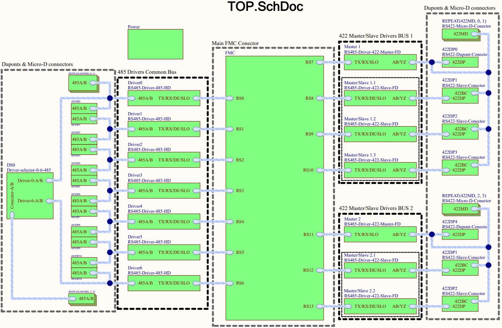

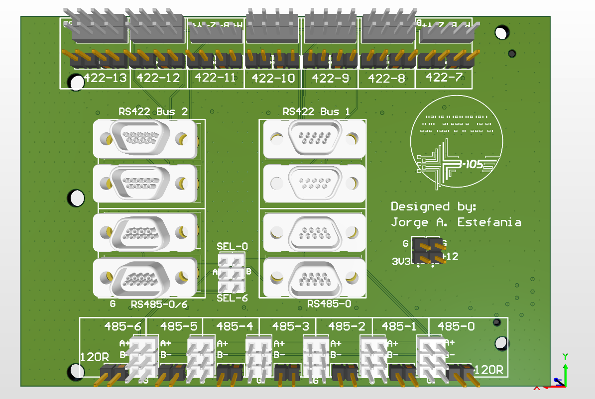
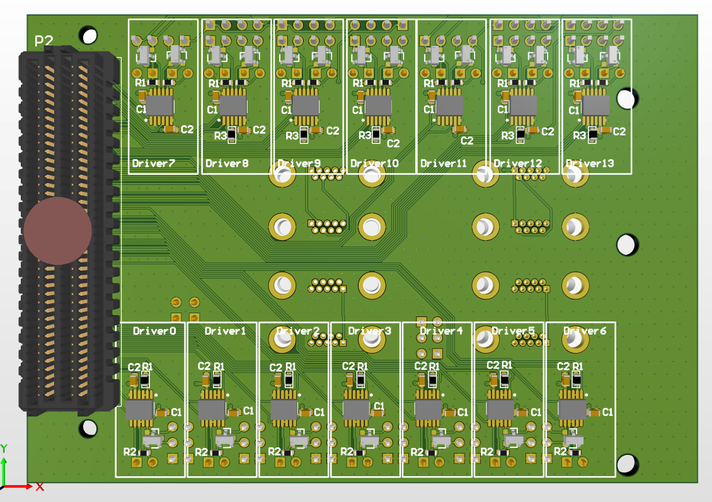

**Topología RS485 configurable por jumper**: conector Dupont de 3 pines (A+, B−, GND) en cada driver
actúa como punto externo e interconexión; jumper entre dos consecutivos une A/B (bus compartido);
sin jumper, driver independiente. Permite cualquier partición de los 7 drivers sin tocar firmware ni
cableado.

**Selector Micro-D**: conectores de mayor densidad compartidos entre Driver 0 y Driver 6 por jumper
de selección.

**Topología RS422 master/slave por jumper**: cada slave con TX-Y+/TX-Z− cruzadas a RX del bus.

**Alimentación**: íntegramente del FMC (12 V, 3,3 V, VADJ 1,8 V); LTC2865 con etapa de bus a 3,3 V
(VCC) y lógica a 1,8 V (VL); sin conversión propia.

Mapa completo de señales → Anexo C. Esquemático (12 hojas) y BOM en `tfm/00_docs/pcbs/serial/`.

## 4.4 Diseño de la placa CDHS

Tarjeta de interconexión ZCU102↔periféricos del subsistema de gestión de datos y calentadores.
Especificaciones de Indra: 6 D-Sub-9 (J1–J6), CAN redundante, tres RS422/RS485, cuatro PWM
calentadores, ADC termistores.


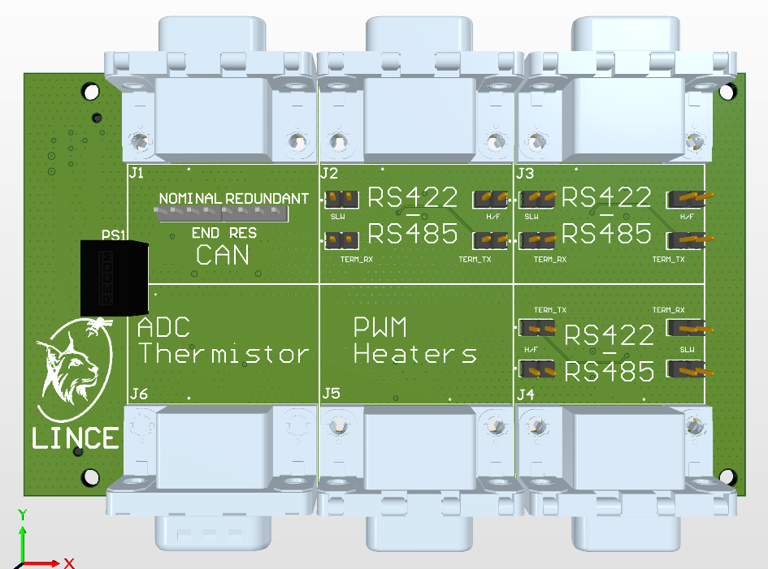
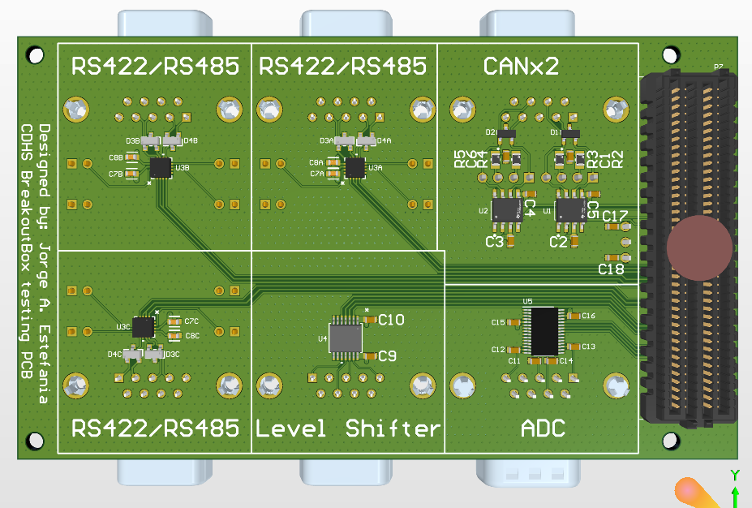

**Nivel de tensión**: todos los bancos FMC HPC a 1,8 V, mismo criterio que §4.1.

**Subsistema CAN**: topología redundante, CAN_NOM y CAN_RED. Elección de transceptor y terminación
parte del estudio de **Diego Ramos** para la plataforma CAN de LINCE. Transceptor
`TCAN1044AVDRQ1` (TI). Terminación *split*: dos resistencias de 60 Ω en serie + condensador 4,7 nF
al plano de masa (equivalente 120 Ω con ambos jumpers puestos; cada resistencia con jumper
independiente). Diodos ESD `ESDCAN24-2BLY`.

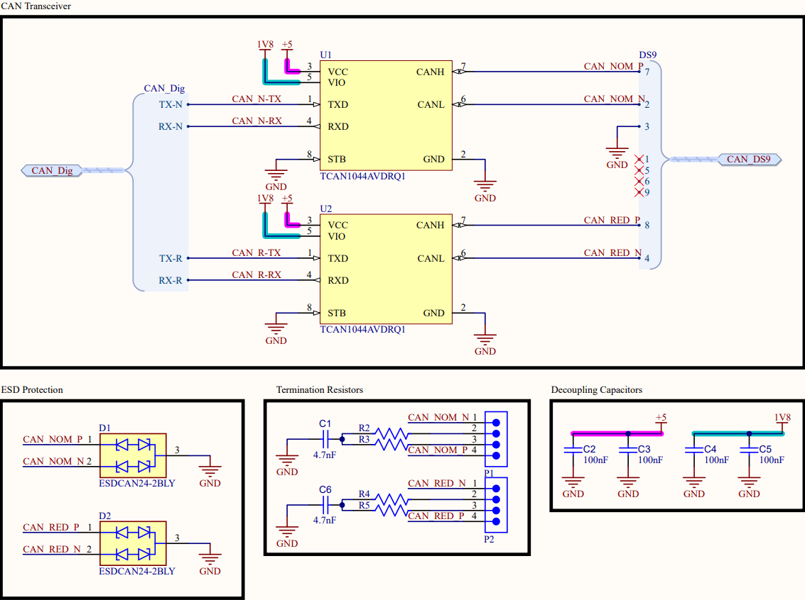

**Subsistema RS422/RS485**: tres canales (RS1, RS2, RS3) con `THVD1424RGTR` (sugerido dentro de
LINCE tras el diseño de la placa serie propia; mejora al LTC2865: terminación interna conmutable,
half/full-duplex sin cambiar hardware). Jumpers H/F, SLR, TERM_TX/TERM_RX. TVS `SM712-02HTG`.

**Cortocircuito DE–RE**: DE (activo alto) y RE (activo bajo) conectados a la misma señal de control
→ complementarios (tabla). Motivo: esclavos solo transmiten bajo demanda del OBC (comunicado por
Indra); en half-duplex, RX activo durante TX generaría eco propio.

| Señal DE/RE | Transmisor (DE) | Receptor (RE activo bajo) |
|---|---|---|
| 1 (alto) | Habilitado | Deshabilitado |
| 0 (bajo) | Deshabilitado | Habilitado |

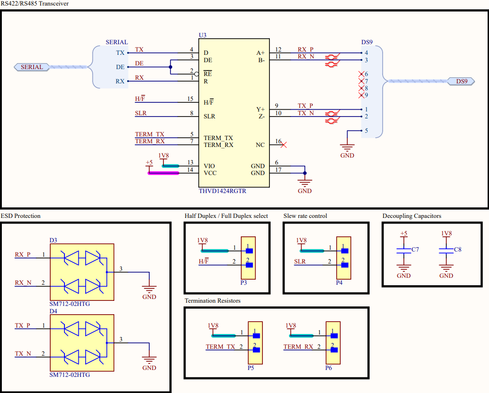

**Subsistema PWM (calentadores)**: 4 señales 1,8 V→3,3 V vía `TXU0104PWR`, salen por J5. Validación:
bloque VHDL autónomo `PWMx4_auto_test` (10 kHz, 5 kHz, 1 kHz, 100 Hz, duty 50 %), sin driver PS.

**Subsistema ADC (termistores)**: 4 entradas (CH0–CH3), `ADS7950QDBTRQ1` (SAR 12 bits, SPI 1,8 V),
analógica a 3,3 V, carriles independientes. J6.

**Alimentación**: FMC 12 V/3,3 V/VADJ 1,8 V; convertidor `R-78E5.0-1.0` genera 5 V para etapa de
potencia RS/CAN (footprint 3 pines, eficiencia ≥96 %).

**Conectores**: 6× D-Sub-9 (J1–J6), escudos a GND.

Mapa de señales → Anexo C. Esquemático y BOM en `tfm/00_docs/pcbs/cdhs/`.

## 4.5 Diseño de la placa AOCS

Interconexión para el subsistema de control de actitud y órbita. 8× D-Sub-9 (J1–J8).

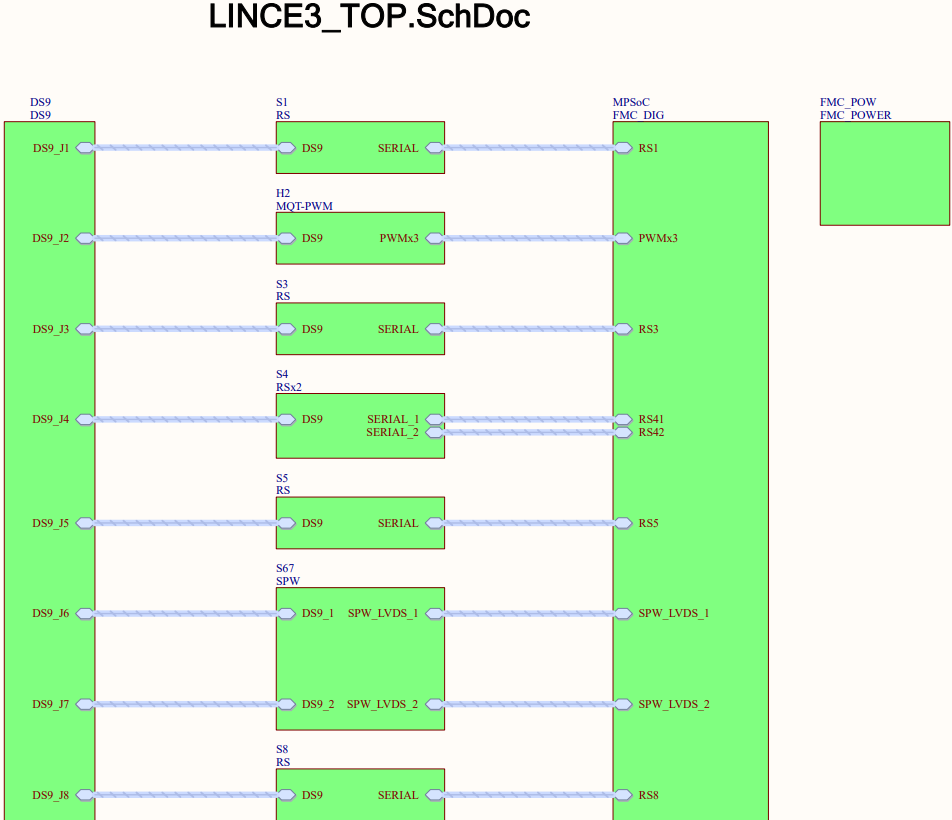

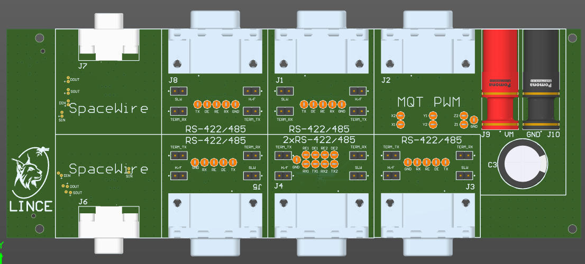
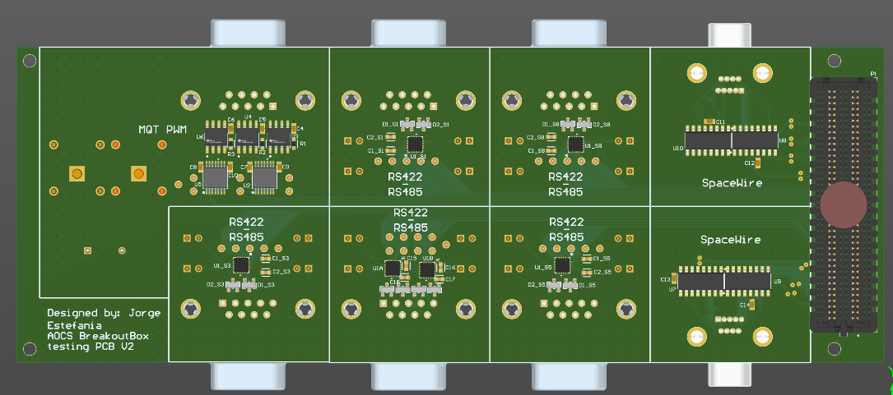

Lo descrito es la **revisión V2** (esquemático cerrado, no fabricada). Las unidades fabricadas y
toda la validación (§5.2) corresponden a la **revisión anterior**, de 5 canales serie. Diferencias
V2: desdoble de J4 en dos canales, separación de DE/RE, puntos de prueba añadidos, corrección del
error de conexión del eje Z.

**Subsistema RS422/RS485**: **seis canales** (RS1, RS3, RS41, RS42, RS5, RS8), mismo `THVD1424RGTR`.
RS41/RS42 comparten J4 (hoja `RSx2`). Salen por 5× D-Sub-9 (J1, J3, J4×2, J5, J8). **DE y RE
independientes** (a diferencia de CDHS: 4 señales/canal en vez de 3) — permite comprobar en banco
combinaciones distintas del cortocircuito (eco propio en half-duplex, alta impedancia con ambos
deshabilitados) mientras el firmware sigue imponiendo el comportamiento complementario.

**Puntos de prueba** (V2): en TX/DE/RE/RX de cada canal + masa, accesibles en cara de conectores;
también en los 6 pares X1/X2, Y1/Y2, Z1/Z2 del PWM de motores. Motivo: depuración (los caracteres
corruptos que motivaron PreDE/PostDE se diagnosticaron pinchando el lado lógico del transceptor).

**Subsistema SpaceWire**: dos enlaces full-duplex (SPW1, SPW2) LVDS, vía repetidores `DS90CP22M` (2
por enlace: entrante DIN/SIN, saliente SOUT/DOUT — 4 en total). Pares con *length matching* y
100 Ω diferencial.

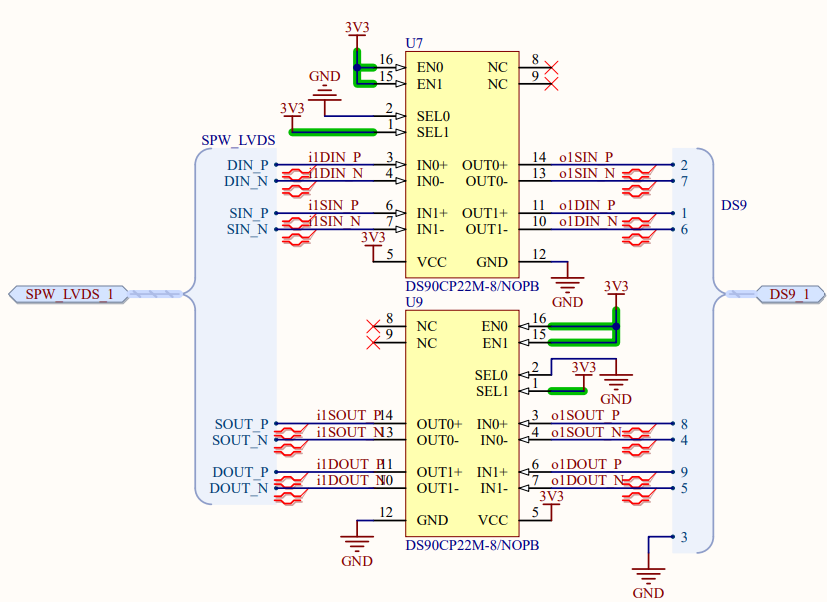

**Subsistema de control de motores (MOT-PWM)**: 6 señales 1,8 V→nivel de puentes en H, 3 pares
(X/Y/Z) por dos adaptadores `TXU0104PWR` (U2: X,Y; U5: Z). J2, bornes banana independientes para
potencia.

**Corrección V2 — eje Z**: en la revisión fabricada, `PWM_Z_1`/`PWM_Z_2` entraban por A2/A1 de U5,
cuyas salidas B2Y/B1Y no llegaban al puente en H (U6), conectado en cambio a **B4Y/B3Y** (canales no
usados, con entradas A4/A3 atadas a masa) → eje Z fijo a nivel bajo, no detectable por
comprobaciones automáticas de Altium. V2 reencamina U6 a B2Y/B1Y.

**Alimentación**: igual que CDHS; potencia de motores independiente vía bornes banana.

Mapa de señales → Anexo C. `LINCE3_AOCS_V2.pdf` es la revisión descrita (la que se fabricará);
`LINCE3_AOCS.pdf` es un volcado anterior desactualizado, conservado por trazabilidad.

## 4.6 Fabricación

PCBWay (placas + stencil), componentes de Mouser/DigiKey. Reflujo SMD en laboratorio: (1) pasta con
stencil alineado, (2) colocación de componentes con pinzas, (3) horno de reflujo.

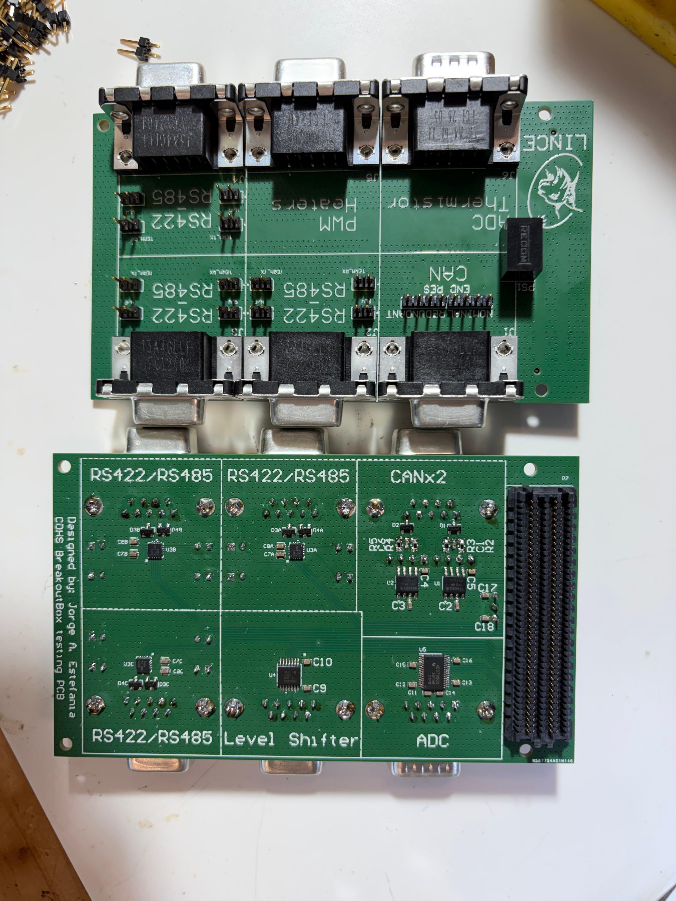
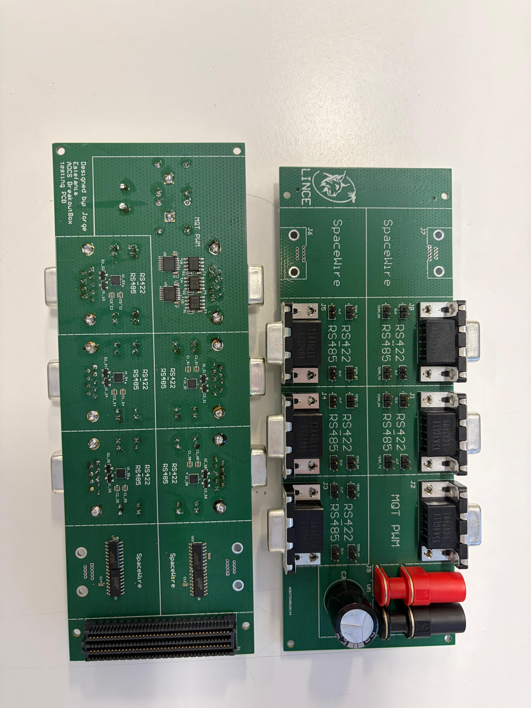
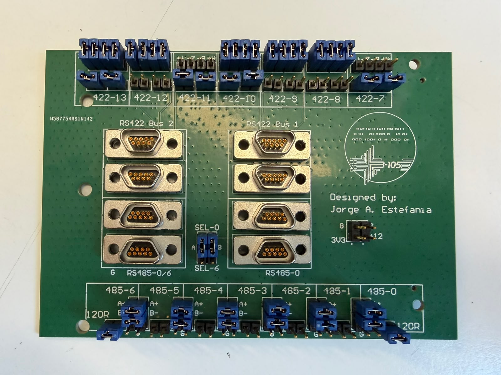
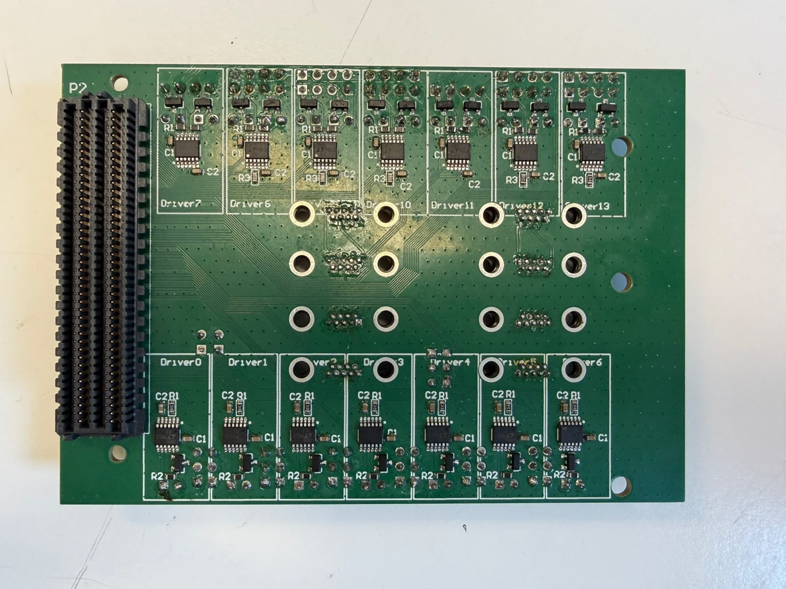

## 4.7 Desarrollo de herramientas de testing

### 4.7.1 Aplicación de testing del driver serie en RTEMS

`init.c` (config estática RTEMS), `transceiver.c/h` (driver), `main.c` (API pública). Abre 14
canales, callback de recepción reconstruye líneas byte a byte, tarea de consola por USB. Comandos:
enviar por canal o `ALL`; conmutar slew rate en caliente. Detalle → Anexo C.

### 4.7.2 Aplicación de testing de las placas CDHS y AOCS

**CDHS**: proyecto Vivado (`new_rebuild_all.tcl`, 3 transceptores) + bloque PWM. SPI 0, CAN 0, CAN 1
como interfaces externas al FMC. `PWMx4_auto_test` (10/5/1 kHz, 100 Hz, duty 50 %), sin driver.
Lectura ADC ADS7950 vía MMIO directo al controlador SPI Cadence del PS (BSP RTEMS 7 sin driver SPI
de alto nivel en ese momento), según UG1085; protocolo del ADC según su datasheet. CAN: batería de
pruebas del driver **CANps de Diego Ramos**.

**AOCS**: proyecto Vivado (5 transceptores) + `Motor_H_Bridge_test.vhd` (3 PWM, enruta línea 1/2 por
motor según dirección; tiempo fijo por sentido). SpaceWire fuera de alcance (exige Data-Strobe, FSM
de enlace, niveles de paquete/red — desarrollo que excede este trabajo).

### 4.7.3 Arneses y equipamiento de validación

Arneses de loopback: **RS422** 4 hilos (cruza TX-P/N↔RX-P/N); **RS485** 2 hilos (A+/B− entre
drivers); **CAN** D-Sub-9 único con hilos cruzados entre CAN nominal y redundante (mismo conector
J1).

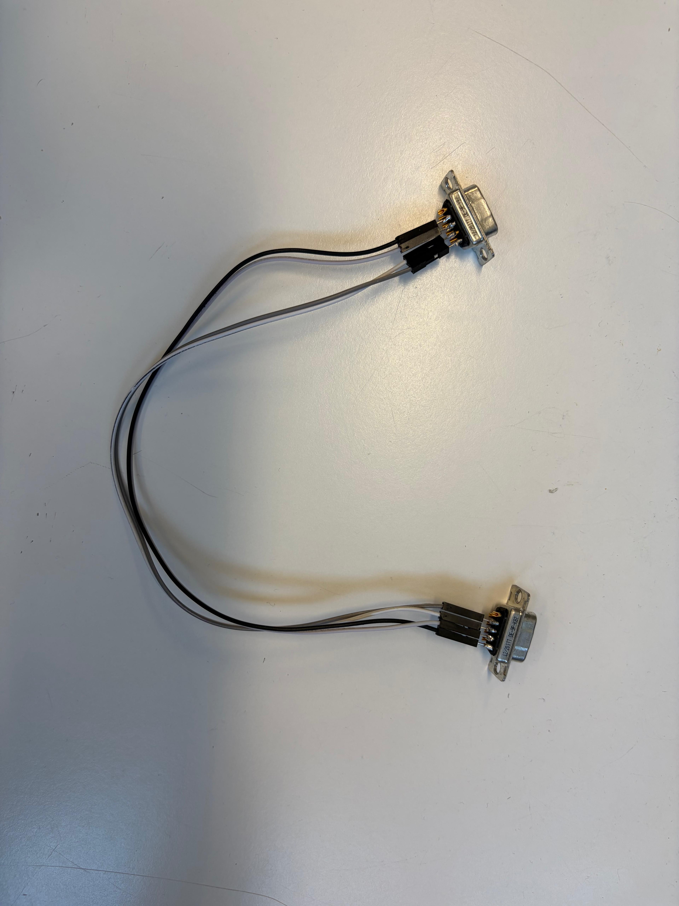
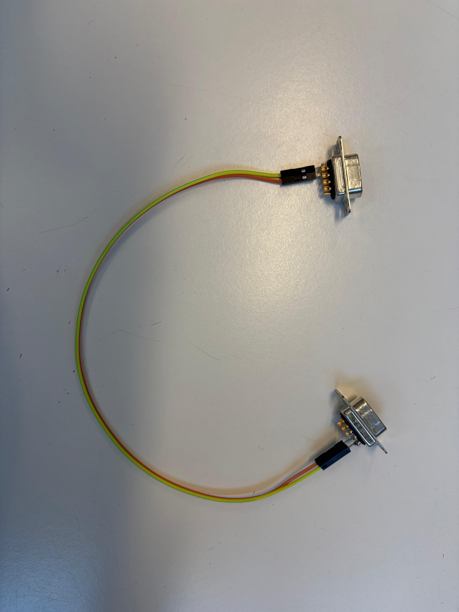
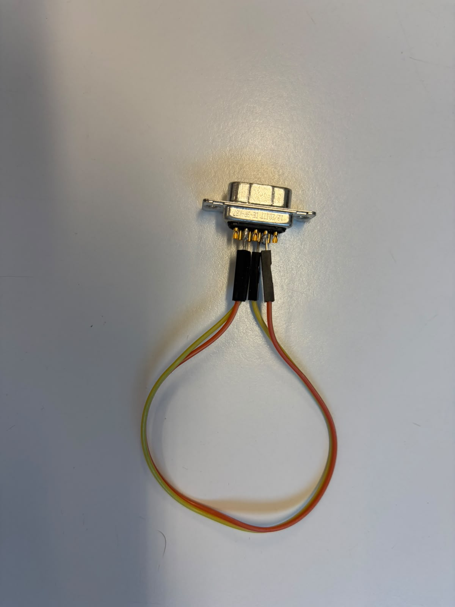

Equipo: osciloscopio y fuente de alimentación hasta 32 V.

---

# Capítulo 5 — Resultados

Orden: §5.1 CDHS, §5.2 AOCS, §5.3 placa comunicación serie (caracterización eléctrica), §5.4
comparativa de arquitecturas de transporte. Orden de validación no coincide con el de diseño
(CDHS/AOCS se validaron antes por calendario: Sener e Indra las necesitaban para su propio
firmware).

## 5.1 Validación CDHS

### Montaje

Conectada por FMC HPC0.

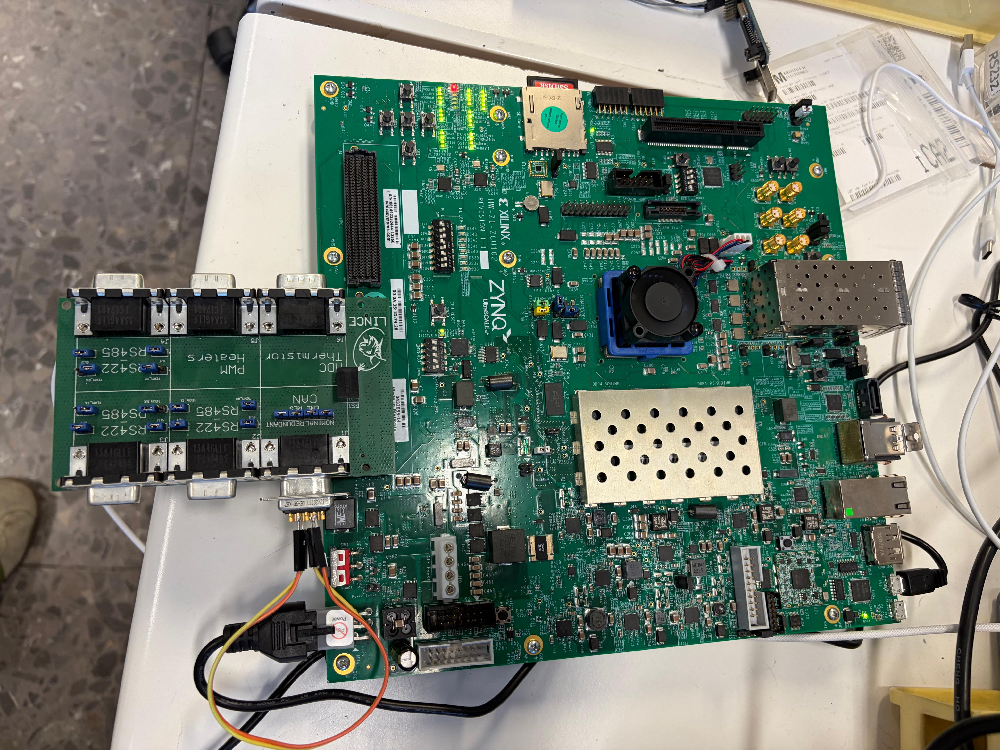

### Comunicaciones serie RS422/RS485

Consola interactiva USB (`<ID> <MENSAJE>` o `ALL <MENSAJE>`). Arneses: RS422 4 hilos cruzados;
RS485 2 hilos.

Descubrimiento automático: 3 transceptores (`0xA0000000`, `0xA0001000`, `0xA0002000`). Loopback
UART0↔UART2 y UART1 correctos. Caracteres corruptos (`?`) en esta captura corresponden a una
iteración previa al fix de robustez del start-bit — tras implementarlo, desaparecieron por completo.
Volcado completo → Anexo C.

**Efecto del control de slew rate**: con el jumper SLR del THVD1424, el flanco pasa de unas pocas
decenas de ns (sin limitador) a ~un cuarto de µs (con limitador) — casi un orden de magnitud. Reduce
emisiones radiadas y sensibilidad a reflexiones, a costa de la velocidad máxima (cuantificado en la
placa serie, §5.3).

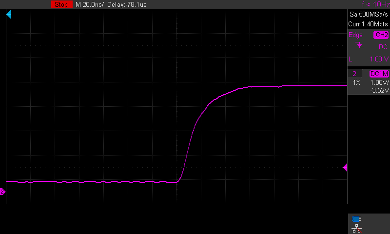
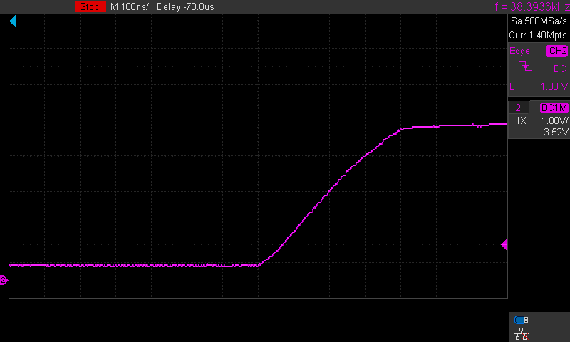
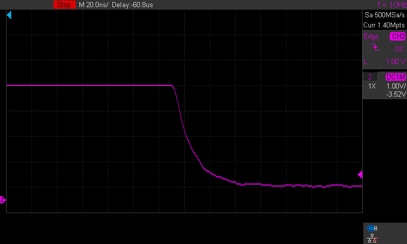
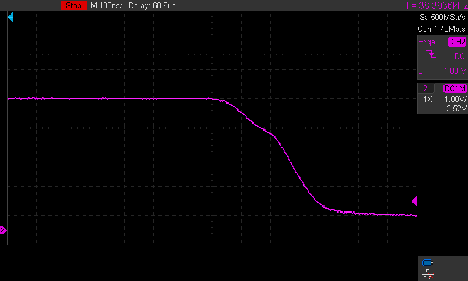

### Bus CAN

Batería de pruebas del driver **CANps (Diego Ramos)**: 26 pruebas (inicialización, loopback interno,
transferencia física CAN0↔CAN1, filtrado ID estándar/extendido, tramas RTR, interrupción HW).
**26/26 PASS, 0 FAILED**:

```
[PASS] CAN0 initialization (Fast Mode)
[PASS] CAN1 initialization (Slow Mode)
[PASS] Loopback RX ID matches TX ID
[PASS] Loopback RX Data matches TX Data
[PASS] CAN0 received correct ID from CAN1        (fisico)
[PASS] CAN0 received correct Data from CAN1      (fisico)
[PASS] Standard ID: Exact Match Accepted (0x1A4)
[PASS] Extended ID: Exact Match Accepted (0x12345678)
[PASS] RTR Filter: Accepted matching Remote Request
[PASS] TxOk fired successfully
[PASS] RxOk fired and FIFO was drained successfully (No Storm)
... (26/26 PASS, 0 FAILED)
```

Efecto de la terminación: sin terminación, reflexiones visibles; con 60+60 Ω, señal limpia.

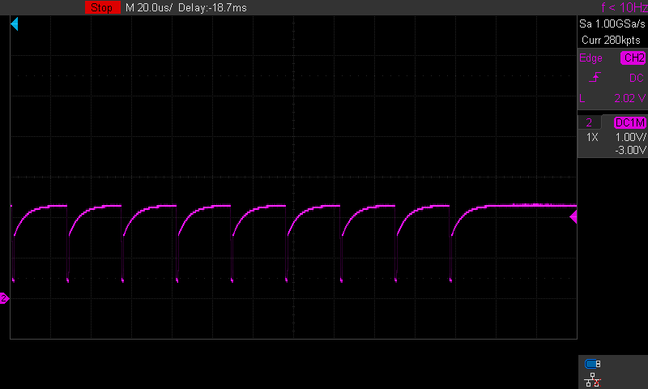
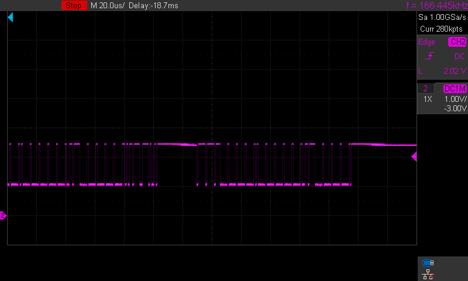

### ADC SPI (termistores)

Muestreo cada 500 ms. 0 V → ~0 digital; 3,3 V → ~4095 (12 bits). Barrido de tensión en CH2:

```
ADS7950: CH0= 244  CH1=  43  CH2=   0  CH3=  19   <- tension en CH2 = 0 V
ADS7950: CH0= 245  CH1=  43  CH2=1577  CH3=  19   <- subida
ADS7950: CH0= 245  CH1=  43  CH2=3419  CH3=  21   <- cerca del maximo
ADS7950: CH0= 245  CH1=  43  CH2=3565  CH3=  21   <- ~2.9 V aplicados
ADS7950: CH0= 245  CH1=  43  CH2=2436  CH3=  22   <- bajada
ADS7950: CH0= 246  CH1=  43  CH2= 102  CH3=  22   <- de vuelta a 0 V
```

CH0 (~245), CH1 (~43), CH3 (~19) estables (no excitados). Volcado completo → Anexo C.

### PWM (calentadores)

10 kHz, 5 kHz, 1 kHz, 100 Hz, todos duty 50 %, medidos en J5.

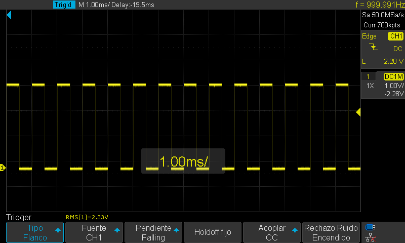

## 5.2 Validación AOCS

### Montaje

Dos unidades fabricadas, revisión anterior a V2 (5 canales serie, DE/RE cortocircuitadas).

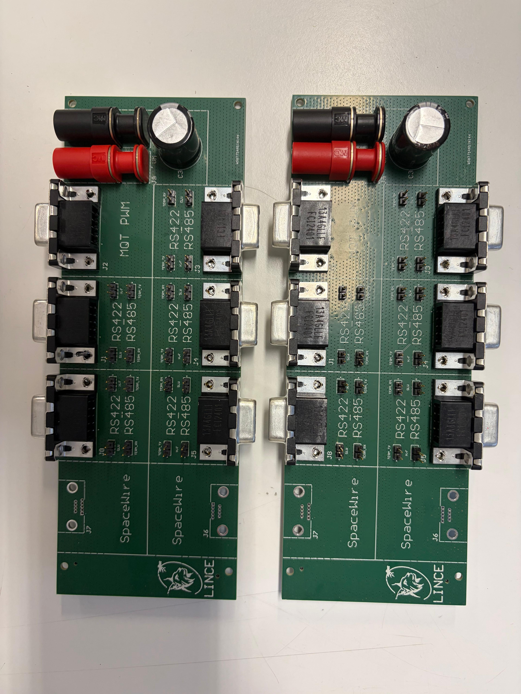

### Comunicaciones serie RS422/RS485

Mismo procedimiento que CDHS. Descubrimiento: 5 instancias (`0xA0000000`–`0xA0004000`, INTC en
`0xA0005000`). Loopback UART0↔4,3,2,1 todo correcto, sin errores de framing (esta sesión ya con el
fix de start-bit — sin caracteres corruptos).

```
[TRANSCEIVER DEBUG] Detectados: 5 | Base: 0xA0000000 | INT: 0xA0005000
CMD> 0 HOLA  ->  [RX UART 04]: HOLA
CMD> 4 HOLA  ->  [RX UART 00]: HOLA
CMD> 0 HOLA  ->  [RX UART 03]: HOLA
CMD> 0 HOLA  ->  [RX UART 01]: HOLA
```

### PWM (puentes en H)

Dirección de giro alternada. Se observa también el error de conexión del eje Z (fallo de placa, no
de firmware, corregido en V2: sin señal en el conector porque las entradas del puente en H colgaban
de salidas del adaptador atadas a masa).

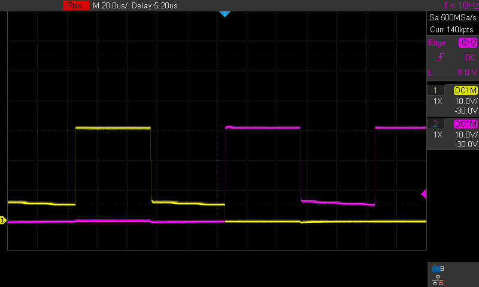

## 5.3 Validación de la placa de comunicación serie

Caracterización eléctrica de los 14 transceptores RS485/RS422 reales (señal atraviesa cobre y
vuelve). Campaña sobre transporte **MCDMA**, bitstream **sin** módulo de loopback (necesario para
que la PCB intervenga).

### Montaje y topología de buses

| Bus | Tipo | Maestro | Esclavos |
|---|---|---|---|
| A | RS485 multipunto (7 nodos) | CH0 | CH1–CH6 |
| B | RS422 punto a punto (estrella) | CH7 | CH8–CH10 |
| C | RS422 punto a punto (estrella) | CH11 | CH12–CH13 |


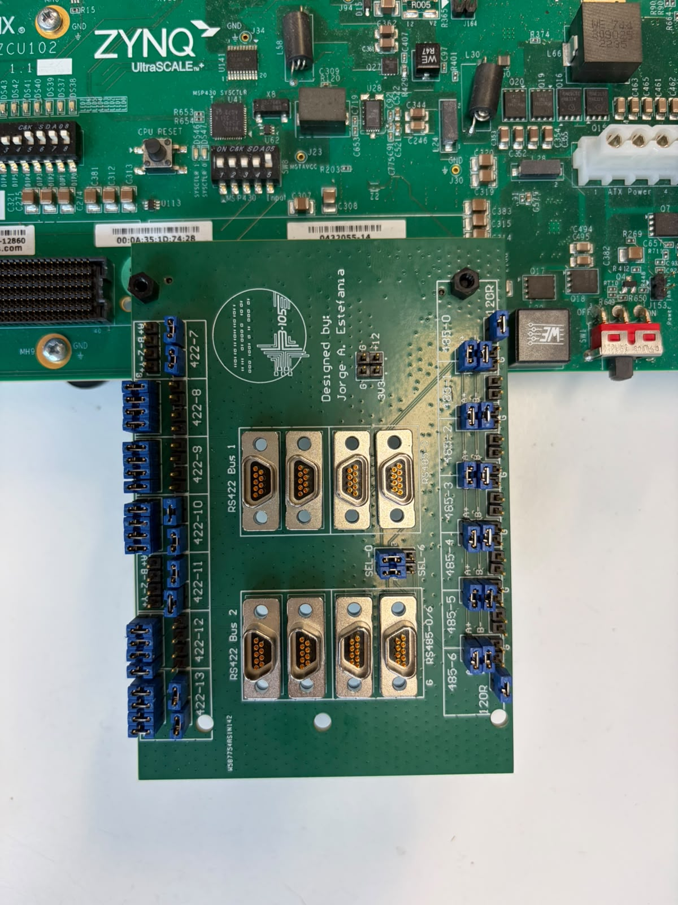

### Batería de pruebas (9 tests)

| Test | Resultado |
|---|---|
| T1 Reposo | 0 bytes espurios en 14 canales |
| T2 Topología | Buses puenteados correctamente, 0 cruces |
| T3 Multipunto | 6/6 esclavos íntegros hasta 460 kbaudios |
| T4 Velocidad máx. (SLO=0) | Bus A: 460 kbaudios; buses B/C: 1 Mbaudios |
| T5 Limitador SLO (SLO=1) | Los 3 buses limpios a 4 Mbaudios |
| T6 Vuelta del bus | Guard time mínimo de 0 µs |
| T7 Diafonía | 0 bytes de fuga entre buses |
| T8 Colisión | Trama corrupta como debe, bus se recupera |
| T9 Estabilidad (10 s) | Bus A 460 kbaudios BER 147 ppm; B/C 1 Mbaudios BER 0 |

Fallos de transmisión de la campaña completa: **cero**.

### Efecto del limitador SLO sobre la velocidad máxima

`SLO` activo a nivel bajo (LTC2865). Por defecto (0): limitado a 250 kbps nominales. A 1: hasta
20 Mbps. Con SLO=1, los 3 buses a **4 Mbaudios** limpios (4× el modo por defecto).

*(Gráfico de barras "Velocidad máxima sin errores por bus y valor de SLO" — generado en pgfplots
dentro de `capitulos/cap5/pcb.tex`, figura `fig:pcb_slo`: Bus A 0,46→4,0 Mbd; Bus B y C 1,0→4,0
Mbd.)*

Cita del datasheet LTC2865: *«SLO (Slow Mode Enable): a low input switches the transmitter to the
slew rate limited 250 kbps max data rate mode. A high input supports 20 Mbps.»*

*(Gráfico de BER vs. velocidad del bus multipunto, con y sin limitador — pgfplots en
`capitulos/cap5/pcb.tex`, figura `fig:pcb_ber`: con SLO=0 se degrada desde 460,8 kbaudios y colapsa
a 2 Mbaudios; con SLO=1, BER nulo en todo el barrido incluyendo 3 y 4 Mbaudios.)*

### Comportamiento del bus multipunto

Bus A satura antes (460 kbaudios vs 1 Mbaudios de B/C con mismo SLO) — coherente con 7 nodos vs.
punto a punto, no es defecto. Con SLO=1, los 3 igualan a 4 Mbaudios.

| Velocidad | 9.600 | 115.200 | 460.800 | 921.600 | 1 M |
|---|---|---|---|---|---|
| Esclavos íntegros (de 6) | 6 | 6 | **6** | 5 | 0 |
| Esclavos parciales | 0 | 0 | 0 | 1 | 6 |

Transición abrupta entre 460k y 1M.

### Integridad, aislamiento y estabilidad

- **T1**: 300 ms de silencio en 14 canales, 0 bytes espurios (fail-safe correcto).
- **T7**: saturando bus A, 0 bytes filtrados a B/C.
- **T6**: guarda 0–1000 µs, respuestas íntegras ya con guarda nula (control de dirección del
  transceptor libera a tiempo).
- **T8**: colisión → trama corrupta pero bus se recupera, siguiente intercambio correcto.
- **T9** (10 s tráfico continuo):

| Bus | Velocidad | Tramas | Bytes | BER |
|---|---|---|---|---|
| A (RS485 multipunto) | 460.800 | 6.781 | 433.984 | 147 ppm |
| B (RS422) | 1.000.000 | 14.408 | 922.112 | **0** |
| C (RS422) | 1.000.000 | 14.466 | 925.824 | **0** |

### Limitaciones del método de medida

- Los conteos parciales de T2 no miden calidad de enlace (artefacto de método: tiempo fijo + lectura
  única); T2 sirve para el **mapa**, no la calidad.
- Los 8 enlaces ausentes de la matriz (de 60 esperados, 52 medidos) corresponden a esclavos de B/C
  que no se oyen entre sí (RS422 en estrella, no multipunto) — coincide con la física de la placa.
- El contador de errores HW de T9 **no es fiable** (marca millones de "errores" en tandas con BER
  medido nulo) — no usado en conclusiones; el BER se calcula comparando byte a byte.

## 5.4 Comparativa de las arquitecturas de transporte PS–PL

Campaña sin ninguna de las 3 placas: buses cerrados en la PL, mide el transporte PS↔PL, no la capa
física.

### Condiciones de la campaña

Bitstream con 14 transceptores (canales 0–13). Las 3 variantes sobre la misma ZCU102, mismo
transceptor de 14 canales, mismo `bench_main.c`, buses cerrados por el módulo de loopback.

**Limitación DMA14**: sin lazo de recepción operativo → magnitudes que dependen de RX (latencia,
throughput, multipunto, desbordamiento, recuperación) figuran con guion; válidas: coste de
hardware, huella de memoria, coste de interrupciones de TX.

### Coste de hardware

Dispositivo XCZU9EG (274.080 LUT, 548.160 registros, 912 BRAM).

| Variante | LUT | % | Registros | BRAM | Potencia | WNS | LUT/canal |
|---|---|---|---|---|---|---|---|
| GPIO | 6.434 | 2,35% | 7.726 | 7 | 3,52 W | 4,69 ns | 460 |
| DMA14 | 40.217 | 14,67% | 53.943 | 35 | 3,86 W | 4,05 ns | 2.873 |
| MCDMA | 14.191 | 5,18% | 16.438 | 18 | 3,62 W | 5,14 ns | 1.014 |

*(Gráfico de barras "Ocupación de la FPGA por variante" — `capitulos/cap5/benchmark.tex`, figura
`fig:bench_hw`: LUT/Registros/BRAM en % del dispositivo.)*

DMA14 cuesta **2,8× más lógica** que MCDMA para el mismo número de canales. WNS positivo y holgado
en las tres (diferencias de rendimiento no atribuibles a implementación física).

### Coste de software

| Variante | Código | RAM del driver | Líneas IRQ | Tareas | Semáforos |
|---|---|---|---|---|---|
| GPIO | 3.099 B | 114.688 B | 1 | 14 | 28 |
| DMA14 | 3.036 B | 115.584 B | 2 | 1 | 15 |
| MCDMA | 3.884 B | 122.434 B | 3 | 1 | 17 |

Memoria total similar (~112–120 KB, dominada por buffers de 4 KB/canal). Diferencia clave: GPIO
necesita **1 tarea de RX por canal** (14 tareas, 28 semáforos); las variantes DMA operan con **una
sola tarea de despacho**.

### Coste en interrupciones

| Variante | IRQ/KB | IRQ TX | IRQ RX | Bytes TX | Bytes RX |
|---|---|---|---|---|---|
| GPIO | 1.250 | 22.161 | 129.382 | 22.161 | 101.890 |
| DMA14 | 3,8* | 85 | --- | 23.132 | --- |
| MCDMA | **3** | 194 | 192 | 23.132 | 101.472 |

\* solo TX.

*(Gráfico de barras en escala lineal — `fig:bench_irq`: GPIO 1250 domina, DMA14 y MCDMA casi
invisibles.)*

En GPIO, IRQ de TX = bytes TX exactamente (22.161=22.161): confirma que la CPU toca cada byte.
MCDMA: 194 TX + 192 RX → 3/KB, **~400× menos** que GPIO.

### Latencia

Frame de 11 bytes, 50 muestras.

| Variante | Media (µs) | p50 | p95 | Máx. | Timeouts |
|---|---|---|---|---|---|
| GPIO | 4.606 | 4.608 | 4.611 | 4.611 | 0 |
| DMA14 | --- | --- | --- | --- | 50 |
| MCDMA | **1.530** | 1.529 | 1.535 | 1.535 | 0 |

MCDMA **3× más rápido**, dispersión muy baja (mediana–máx = 6 µs), determinista.

### Throughput

Techo físico a 115.200 8N1: **11.520 B/s**.

| Variante | 1 canal | 3 maestros | 6 receptores | Reps. sin pérdidas |
|---|---|---|---|---|
| GPIO | 3.471 (30%) | 10.411 | 20.838 | 5/5 |
| DMA14 | --- | --- | --- | --- |
| MCDMA | **11.461 (99%)** | **34.303** | **68.504** | 5/5 |

MCDMA alcanza **99% del techo físico**; GPIO se queda en 30%. Con carga concurrente (6 receptores),
diferencia se amplía: 68.504 vs 20.838 B/s.

### Barrido de velocidad

Bloque de 1 KB en cada punto, los 14 transceptores reprogramados.

| Variante | 115.200 | 230.400 | 460.800 | 921.600 | 1.000.000 | 2.000.000 | 4.000.000 |
|---|---|---|---|---|---|---|---|
| GPIO | 3.471 | 4.087 | 4.485 | 4.714 | 4.733 | 4.848 | 4.907 |
| MCDMA | 11.458 | 22.789 | 45.104 | 88.298 | 96.186 | 183.053 | **344.781** |

**GPIO se satura**: ×35 velocidad de línea → solo +41% throughput (cuello de botella = CPU).
**MCDMA escala linealmente**: 344.781 B/s a 4 Mbaudios, **70× lo que consigue GPIO** en el mismo
punto.

*(Gráfico log-log throughput vs velocidad — `fig:bench_baudios`.)*

IRQ/s: GPIO se estanca en ~34.000 IRQ/s (livelock); MCDMA crece ×30 su throughput con <3.700 IRQ/s
a 4 Mbaudios (~10× menos). *(Gráfico log-log — `fig:bench_irq_throughput`.)* Errores de transporte:
cero en ambas, en los 7 puntos.

### Robustez

3 frames corruptos + 1 válido (T7); 8 KB sin vaciar ring de 4 KB (T5).

| Variante | Frames corruptos | Se recupera | Bytes aceptados | Bytes descartados |
|---|---|---|---|---|
| GPIO | 3/3 | sí | 24.576 | 16.246 |
| DMA14 | 3/3 | --- | --- | --- |
| MCDMA | 3/3 | sí | 24.576 | 24.576 |

Los 3 rechazan los 3 frames corruptos. Bytes descartados **no son errores de transporte** (0 en las
tres) — cuentan datos correctos que no caben en el ring por no leerse (mayoría de T5). MCDMA
descarta más porque entrega más rápido, no por defecto.

### Selección de la arquitectura de transporte

| | GPIO | DMA14 | MCDMA |
|---|---|---|---|
| Lógica (LUT) | **6.434** | 40.217 | 14.191 |
| IRQ/KB | 1.250 | 3,8 (solo TX) | **3** |
| Throughput 1 canal | 3.471 B/s (30%) | --- | **11.461 B/s (99%)** |
| Latencia | 4.606 µs | --- | **1.530 µs** |
| Escala con baudrate | no | --- | **sí** |
| Líneas IRQ necesarias | 1 | 28 (→2) | 3 |
| Complejidad de diseño | **baja** | media | alta |

**MCDMA con puente VHDL es la arquitectura adecuada**: mueve paquetes en lugar de bytes (1.250→3
IRQ/KB explica el resto: latencia, 99% de techo, escalabilidad).

DMA14 resuelve el problema correcto por un camino que no escala: 2,8× más lógica y 28 líneas IRQ
(el silicio ofrece 8) — límite del dispositivo, no del diseño. Además, 14,7% del área es
incompatible con TMR futuro (frente al 5,2% de MCDMA).

*(Gráfico "Compromiso entre ocupación y coste en interrupciones", con proyección ×3 TMR —
`fig:bench_compromiso`: MCDMA triplicado ≈ 15,5% LUT (vs 44% de DMA14 triplicado ≈ inviable).)*

GPIO es razonable **para pocos canales a baja velocidad** (menos de la mitad de lógica que MCDMA,
sin MMU ni coherencia de caché) — pero no sirve para 14 canales, y su límite no se cura subiendo la
velocidad de línea.

---

# Capítulo 6 — Conclusiones y líneas futuras

## 6.1 Conclusiones

Objetivo principal cumplido, revisado objetivo a objetivo:

1. **Transceptor VHDL configurable — cumplido.** RS422/RS485, formato de trama configurable en
   ejecución (50–4.000.000 baudios/54 entradas, 5–9 bits, 5 paridades, 3 parada incl. 1,5,
   2 órdenes). NCO validado velocidad a velocidad: error nulo/≤1 ppm en la mayoría, 120 ppm en el
   peor punto (2 órdenes de magnitud bajo tolerancia UART). Canal completo: 150 configuraciones,
   450 tramas sin error. 14 instancias simultáneas en placa.

2. **Arquitectura de transporte PL↔PS — de mayor recorrido, cumplido con MCDMA.** Tres
   arquitecturas completas implementadas y medidas (no elegidas sobre papel). GPIO: 1 IRQ/byte,
   30% del techo, no mejora con velocidad (cuello de botella = CPU). Solución final: **3 IRQ/KB,
   99% del techo físico**, escala linealmente hasta 345 kB/s a 4 Mbaudios. DMA14 funcionó pero se
   descartó por recursos (2,8× lógica, 28 líneas IRQ donde el MPSoC ofrece 8, área incompatible con
   TMR futuro) — ese límite justificó el puente propio.

3. **Driver completo en C sobre RTEMS 7 — cumplido en sus tres versiones.** API de 6 funciones,
   descubrimiento dinámico de hardware (mismo binario de 1 a 14 canales), orientado a interrupción
   sin bloquear al procesador. Separación ISR maestra / tareas worker preserva determinismo.

4. **Placa de comunicación serie — cumplida y caracterizada.** 14 canales en bus RS485 multipunto
   (7 nodos) + 2 buses RS422 master/slave, configurables por jumper. 9 tests superados: 0 bytes
   espurios en reposo, 0 fugas entre buses, recuperación limpia tras colisión, BER nulo en RS422
   tras 10 s continuos. Hallazgo: limitador de slew rate (activo por defecto) fijaba el techo entre
   460 kbaudios y 1 Mbaudios; desactivado, **4 Mbaudios** con BER nulo, sin tocar cobre ni lógica.

5. **Placas CDHS y AOCS bajo especificación de Indra — cumplido.** CDHS: CAN redundante, 3 canales
   RS422/RS485, 4 PWM calentadores, ADC termistores (6 D-Sub-9). AOCS: canales serie, control de
   motores PWM, 2 SpaceWire (8 D-Sub-9). Fabricación sin retrabajos (diseño contra capacidades del
   fabricante). Restricción 1,8 V obligó a descartar herencia de vuelo — declarado explícitamente:
   hardware de validación funcional, no de vuelo. AOCS con error de eje Z, corregido en V2.

6. **Integración y validación del sistema completo — cumplido salvo SpaceWire.** RS422/RS485 de
   CDHS/AOCS, CAN de CDHS (26/26, incl. efecto de terminación), ADC lineal, PWM de ambas placas,
   todo validado. **SpaceWire sin validar**: la placa expone la capa física LVDS, pero ejercitarlo
   exige implementar Data-Strobe, FSM de enlace y niveles superiores — excede el alcance.

**Volumen**: **20.188 líneas de código propio** (tabla completa en Anexo C). Código de verificación
casi iguala al hardware que verifica; automatización = mayor partida (40%).

Conclusión general: plataforma validada sobre medidas propias, arquitectura de transporte elegida
por datos y no por catálogo (3 IRQ/KB, menos lógica que la alternativa DMA14) — contribución directa
a LINCE y base para el B105.

## 6.2 Líneas futuras

- **Cerrar pendientes de validación**: invertir el valor por defecto de `SLO` (arranque a
  4 Mbaudios), fabricar y probar la V2 de AOCS, completar la medida de recepción de DMA14.
- **Poner en servicio SpaceWire** sobre la capa física ya disponible (AOCS): incorporar controlador
  SpaceWire y colgarlo del transporte MCDMA ya desarrollado (admite canales adicionales sin
  rediseño); reutilizar el esquema de verificación de este trabajo.
- **Ampliar driver y pruebas a condiciones de operación del satélite**: ejecuciones largas,
  tratamiento/recuento de errores de trama y colisión en RS485 multipunto, exponer estadísticas a
  capa superior — sobre la API de 6 funciones ya definida, sin tocar RTL.
- **Endurecer la plataforma frente a radiación**: TMR del transceptor/puente/lógica propia +
  scrubbing de configuración (el 5,2% de MCDMA triplicado ≈16%, frente al 44% de DMA14 triplicado);
  watchdog + ECC en software; sustitución de componentes por herencia de vuelo en placas (resolviendo
  la restricción de 1,8 V del VADJ). Cada medida debe superar la misma campaña de pruebas, y en
  última instancia ensayos de inyección de fallos o irradiación.

---

# Anexo A — Aspectos éticos, económicos, sociales y ambientales

## A.1 Introducción

Marco: proyecto LINCE, PERTE Aeroespacial, Indra. Objetivo: subsistema de comunicaciones serie del
OBC — diseño hardware (PCB de prueba) y firmware sobre RTOS.

## A.2 Impactos relevantes

- **Autonomía estratégica y tejido industrial** (económico/social): LINCE busca capacidad propia de
  producción en serie de microsatélites. Un transceptor VHDL propio, auditable y sin dependencia de
  licencias externas, frente a componente cerrado de terceros. Deja conocimiento en el país
  (formar/retener perfil especializado es difícil sin continuidad de proyectos — el PERTE busca masa
  crítica autosostenible).
- **Doble uso civil y militar**: plataforma de observación/comunicaciones LEO es tecnología de doble
  uso por definición. El trabajo se sitúa en la capa más genérica (transporte de datos), pero se
  declara su condición de doble uso — responsabilidad recae en marco regulatorio y decisiones del
  consorcio.
- **Residuos electrónicos**: 6 PCB físicas (2 de cada diseño) + revisiones descartadas → RAEE
  (Directiva 2012/19/UE); componentes conformes a RoHS (Directiva 2011/65/UE). Enfoque NewSpace
  (COTS) acorta vida útil, aumenta frecuencia de sustitución.
- **Sostenibilidad orbital**: LEO, densidad de objetos como principal problema del sector (informe
  anual de la Oficina de Basura Espacial de la ESA); un fallo de aviónica no recuperable adelanta
  sustitución/lanzamiento adicional.
- **Consumo energético**: la PL es el único elemento cuyo consumo depende de las decisiones de este
  trabajo — 3,52 W (GPIO), 3,86 W (DMA14), 3,62 W (MCDMA, seleccionada). En un satélite con
  presupuesto de potencia cerrado, cada vatio de aviónica no está disponible para la carga de pago.

## A.3 Análisis detallado: impacto energético

Magnitud relevante: **energía por byte útil transportado**, no la potencia instantánea. Con 6
receptores simultáneos:

| Variante | Potencia | Caudal sostenido | Energía por byte |
|---|---|---|---|
| GPIO | 3,52 W | 20.838 B/s | 169 µJ |
| MCDMA | 3,62 W | 68.504 B/s | 52,8 µJ |

MCDMA consume 0,10 W más (2,8%) pero es **3,2× más eficiente por byte**. DMA14 (3,86 W) es la que
más consume en absoluto.

Interpretación: consecuencia directa de sacar a la CPU de la ruta de datos (1.250→3 IRQ/KB). Margen
liberado doble: **CPU** (procesador en espera de evento → menor consumo medio, potencia disponible
para carga de pago o generador/baterías más pequeños) y **área** (5,18% vs 14,67% → TMR viable en
MCDMA, ~16%, inviable en DMA14, ~44%) — lo que hace posible endurecer frente a SEU y evitar
sustitución/lanzamiento adicional.

Caudal de misión no fijado: con tráfico alto, el argumento se sostiene por energía/byte y margen de
CPU; con tráfico bajo la ventaja se diluye, pero GPIO tampoco era opción por número de canales/coste
de interrupción — el cambio es favorable en ambos escenarios.

Limitaciones: cifras de potencia son estimación del implementador de Vivado (no medida en carril),
válidas para comparar variantes entre sí; no incluye el consumo del PS.

## A.4 Conclusiones del anexo

- **Económico**: sustituye por desarrollo propio un bloque que de otro modo se adquiriría fuera de
  la UE; coste (Anexo B) un orden de magnitud inferior a cualificar una solución comercial
  equivalente.
- **Social**: impacto indirecto pero real (doble uso, declarado explícitamente).
- **Medioambiental**: balance con dos signos — residuo generado (NewSpace acorta vida útil) frente a
  arquitectura 3,2× más eficiente por byte y margen de área para endurecimiento (vida operativa más
  larga, menos lanzamientos de reposición). RoHS cumplida; gestión RAEE de placas descartadas.
- **Ético/gestión**: criterio de declarar limitaciones en vez de omitirlas (hardware de validación
  no de vuelo, SpaceWire sin validar y motivo, limitaciones de cada método de medida, errores de
  diseño y sus correcciones). Decisiones sobre medidas propias reproducibles, código y bancos de
  prueba publicados.

---

# Anexo B — Presupuesto económico

Criterios: mano de obra real (beca de 500 €/mes × 10 meses = **5.000 €**); recursos materiales
amortizados en proporción al uso (ZCU102, estación de trabajo, osciloscopio, analizador lógico,
fuente, estación de soldadura, multímetro, licencias Vivado ML Enterprise y Altium Designer anuales)
= **4.002,72 €**; gastos generales 15% sobre CD + beneficio industrial 6% sobre CD+CI; material
fungible (componentes de las 3 placas ×2 unidades + fabricación con stencil + cableado/consumibles)
= **1.442,92 €**; IVA 21%.

| Partida | Importe |
|---|---|
| Coste total de mano de obra | 5.000,00 € |
| Coste total de recursos materiales | 4.002,72 € |
| **Coste directo (CD)** | **9.002,72 €** |
| Gastos generales (15% sobre CD) | 1.350,41 € |
| Beneficio industrial (6% sobre CD+CI) | 621,19 € |
| Coste total de material fungible | 1.442,92 € |
| **Subtotal presupuesto** | **12.417,24 €** |
| IVA (21%) | 2.607,62 € |
| **TOTAL PRESUPUESTO** | **15.024,86 €** |

Desglose de material fungible: placa comunicación serie 424,13 €; CDHS 116,77 €; AOCS 302,02 €;
fabricación con stencil (3 placas × 2 uds.) 420,00 €; cableado/conectores/microSD/consumibles
180,00 €.

Mano de obra = mayor partida (40% del subtotal); recursos materiales amortizados 32% (licencias
pesan más que el equipamiento); hardware fabricado 10%.

**Nota de referencia de mercado**: la mano de obra imputada es la beca real, no precio de mercado.
Con tarifa de ingeniero junior de 30 €/hora sobre 800 horas equivalentes, la partida pasaría de
5.000 € a 24.000 € y el total rondaría los **43.000 €** — cifra de referencia para reproducir el
desarrollo en un entorno industrial.

---

# Anexo C — Material de consulta, detalle de implementación y volcados de terminal

Organizado en tres bloques: (C.1–C.5) material de consulta — mapas de señales, tabla del NCO,
recuento de código; (C.6–C.8) detalle de implementación — RTL de bloques auxiliares, app de testing
del driver, ejemplo completo de la puerta AND; (C.9–C.10) volcados completos de terminal de la
validación hardware.

## C.1 Mapa de señales — LINCE Comunicación Serial

14 drivers RS485/RS422 ↔ FMC HPC0 (P2) de la ZCU102. Cada driver expone TX, RX, SLO y DE (ausente en
drivers 7 y 11, solo control de dirección hardware). Tabla completa (Driver / Señal / Red interna /
Red FMC HPC0 / Pin FMC / Pin Zynq), 56 filas — resumen por driver:

| Driver | TX (red FMC) | RX (red FMC) | SLO (red FMC) | DE (red FMC) |
|---|---|---|---|---|
| 0 | LA32_N (H38/T11) | LA26_N (D27/K15) | LA27_N (C27/L10) | LA33_N (G37/V11) |
| 1 | LA33_P (G36/V12) | LA30_N (H35/U6) | LA32_P (H37/U11) | LA27_P (C26/M10) |
| 2 | LA30_P (H34/V6) | LA26_P (D26/L15) | LA31_N (G34/V7) | LA31_P (G33/V8) |
| 3 | LA29_N (G31/U8) | LA29_P (G30/U9) | LA28_N (H32/T6) | LA28_P (H31/T7) |
| 4 | LA14_P (C18/AC7) | LA13_N (D18/AC8) | LA22_P (G24/M15) | LA19_N (H23/K13) |
| 5 | LA20_N (G22/M13) | LA15_N (H20/Y9) | LA19_P (H22/L13) | LA20_P (G21/N13) |
| 6 | LA15_P (H19/Y10) | LA13_P (D17/AB8) | LA16_N (G19/AA12) | LA16_P (G18/Y12) |
| 7 | LA06_P (C10/AC2) | LA01_CC_N (D9/AC4) | LA01_CC_P (D8/AB4) | — |
| 8 | LA05_P (D11/AB3) | LA05_N (D12/AC3) | LA06_N (C11/AC1) | LA10_P (C14/W5) |
| 9 | LA02_P (H7/V2) | LA00_CC_N (G7/Y3) | LA00_CC_P (G6/Y4) | LA02_N (H8/V1) |
| 10 | LA09_P (D14/W2) | LA03_N (G10/Y1) | LA03_P (G9/Y2) | LA04_P (H10/AA2) |
| 11 | LA08_N (G13/V3) | LA08_P (G12/V4) | LA04_N (H11/AA1) | — |
| 12 | LA10_N (C15/W4) | LA07_N (H14/U4) | LA07_P (H13/U5) | LA09_N (D15/W1) |
| 13 | LA11_N (H17/AB5) | LA11_P (H16/AB6) | LA12_P (G15/W7) | LA12_N (G16/W6) |

(Formato de cada celda: `Red FMC_HPC0_... (Pin FMC / Pin Zynq)`. Tabla completa con las 56 filas
originales en `capitulos/anexos/anexoC.tex`, entorno `longtable`, etiqueta `tab:mapa_lince_serial`.)

## C.2 Mapa de señales — CDHS

| Subsistema | Señal | Red (FMC HPC0) | Pin FMC | Pin Zynq |
|---|---|---|---|---|
| SPI (ADC) | SDO | LA02_N | H8 | V1 |
| SPI (ADC) | SDI | LA00_CC_N | G7 | Y3 |
| SPI (ADC) | SCLK | LA02_P | H7 | V2 |
| SPI (ADC) | CS_N | LA00_CC_P | G6 | Y4 |
| CAN (Nominal) | TX_N | LA21_P | H25 | P12 |
| CAN (Nominal) | RX_N | LA22_P | G24 | M15 |
| CAN (Redundante) | TX_R | LA21_N | H26 | N12 |
| CAN (Redundante) | RX_R | LA22_N | G25 | M14 |
| RS1 (Serial 1) | TX | LA15_P | H19 | Y10 |
| RS1 (Serial 1) | RX | LA11_N | H17 | AB5 |
| RS1 (Serial 1) | DE | LA16_P | G18 | Y12 |
| RS2 (Serial 2) | TX | LA12_N | G16 | W6 |
| RS2 (Serial 2) | RX | LA12_P | G15 | W7 |
| RS2 (Serial 2) | DE | LA11_P | H16 | AB6 |
| RS3 (Serial 3) | TX | LA07_N | H14 | U4 |
| RS3 (Serial 3) | RX | LA07_P | H13 | U5 |
| RS3 (Serial 3) | DE | LA08_N | G13 | V3 |
| PWM (Heaters) | IN1 | LA04_N | H11 | AA1 |
| PWM (Heaters) | IN2 | LA04_P | H10 | AA2 |
| PWM (Heaters) | IN3 | LA03_P | G9 | Y2 |
| PWM (Heaters) | IN4 | LA03_N | G10 | Y1 |

## C.3 Mapa de señales — AOCS (revisión V2)

Cada canal serie con DE y RE separados (4 señales/canal); J4 alberga RS41 y RS42.

| Subsistema | Señal | Red (FMC HPC0) | Pin FMC | Pin Zynq |
|---|---|---|---|---|
| RS1 (J1) | TX/RX/DE/RE | LA19_P / LA17_CC_N / LA18_CC_P / LA20_P | H22/D21/C22/G21 | L13/N11/N9/N13 |
| MOT-PWM (J2) | PWM_X_1/X_2 | LA17_CC_P / LA15_N | D20/H20 | P11/Y9 |
| MOT-PWM (J2) | PWM_Y_1/Y_2 | LA16_N / LA15_P | G19/H19 | AA12/Y10 |
| MOT-PWM (J2) | PWM_Z_1/Z_2 | LA16_P / LA13_N | G18/D18 | Y12/AC8 |
| RS3 (J3) | TX/RX/DE/RE | LA11_N / LA11_P / LA14_P / LA13_P | H17/H16/C18/D17 | AB5/AB6/AC7/AB8 |
| RS41 (J4) | TX/RX/DE/RE | LA12_N / LA09_N / LA10_N / LA12_P | G16/D15/C15/G15 | W6/W1/W4/W7 |
| RS42 (J4) | TX/RX/DE/RE | LA07_N / LA07_P / LA09_P / LA08_N | H14/H13/D14/G13 | U4/U5/W2/V3 |
| RS5 (J5) | TX/RX/DE/RE | LA05_N / LA05_P / LA08_P / LA06_N | D12/D11/G12/C11 | AC3/AB3/V4/AC1 |
| SPW1 (J6) | DIN/SIN/SOUT/DOUT (P/N) | LA02, LA04, LA01_CC, LA00_CC | H7-H11,D8-D9,G6-G7 | V1-V2,AA1-AA2,AB4/AC4,Y3-Y4 |
| SPW2 (J7) | DIN/SIN/SOUT/DOUT (P/N) | LA24, LA21, LA28, LA30 | H28-H35 | L12-U6 |
| RS8 (J8) | TX/RX/DE/RE | LA22_P / LA20_N / LA19_N / LA23_P | G24/G22/H23/D23 | M15/M13/K13/L16 |

(Tabla completa fila a fila en `capitulos/anexos/anexoC.tex`, `tab:mapa_aocs`.)

## C.4 Tabla de frecuencias del NCO

Tabla completa de 54 entradas (50–4.000.000 baudios); aquí las 29 verificadas en simulación
(9.600–3,6864 Mbaudios). Columnas: Baud, Half, INC_ROM, INC_HALF_ROM, Medido (Hz), Error (ppm).

| Baud | INC_ROM | INC_HALF_ROM | Medido (Hz) | Error (ppm) |
|---|---|---|---|---|
| 9.600 | 412.316 | 824.633 | 9.600,002 | 0,2 |
| 14.400 | 618.475 | 1.236.950 | 14.399,988 | −0,8 |
| 19.200 | 824.633 | 1.649.267 | 19.200,012 | 0,6 |
| 28.800 | 1.236.950 | 2.473.901 | 28.799,977 | −0,8 |
| 31.250 | 1.342.177 | 2.684.354 | 31.250,000 | 0,0 |
| 38.400 | 1.649.267 | 3.298.534 | 38.400,025 | 0,6 |
| 56.000 | 2.405.181 | 4.810.363 | 55.999,978 | −0,4 |
| 57.600 | 2.473.901 | 4.947.802 | 57.600,037 | 0,6 |
| 74.400 | 3.195.455 | 6.390.911 | 74.400,057 | 0,8 |
| 115.200 | 4.947.802 | 9.895.604 | 115.200,074 | 0,6 |
| 128.000 | 5.497.558 | 10.995.116 | 128.000,000 | 0,0 |
| 153.600 | 6.597.069 | 13.194.139 | 153.600,393 | 2,6 |
| 230.400 | 9.895.604 | 19.791.209 | 230.398,820 | −5,1 |
| 256.000 | 10.995.116 | 21.990.232 | 256.000,000 | 0,0 |
| 312.500 | 13.421.772 | 26.843.545 | 312.500,000 | 0,0 |
| 460.800 | 19.791.209 | 39.582.418 | 460.808,258 | 17,9 |
| 500.000 | 21.474.836 | 42.949.672 | 500.000,000 | 0,0 |
| 576.000 | 24.739.011 | 49.478.023 | 576.003,686 | 6,4 |
| 614.400 | 26.388.279 | 52.776.558 | 614.401,573 | 2,6 |
| 750.000 | 32.212.254 | 64.424.509 | 749.990,625 | −12,5 |
| 921.600 | 39.582.418 | 79.164.837 | 921.616,515 | 17,9 |
| 1.000.000 | 42.949.672 | 85.899.345 | 1.000.000,000 | 0,0 |
| 1.152.000 | 49.478.023 | 98.956.046 | 1.152.007,373 | 6,4 |
| 1.500.000 | 64.424.509 | 128.849.018 | 1.499.925,004 | −50,0 |
| 1.843.200 | 79.164.837 | 158.329.674 | 1.843.148,097 | −28,2 |
| 2.000.000 | 85.899.345 | 171.798.691 | 2.000.000,000 | 0,0 |
| 2.500.000 | 107.374.182 | 214.748.364 | 2.500.000,000 | 0,0 |
| 3.000.000 | 128.849.018 | 257.698.037 | 3.000.300,030 | 100,0 |
| 3.686.400 | 158.329.674 | 316.659.348 | 3.685.956,506 | −120,3 |

(Todas las entradas con `Half=0`; el testbench mide también cada una en modo `Half=1`, ver el
código fuente para el detalle completo.)

## C.5 Volumen y distribución del código desarrollado

Criterio restrictivo: excluye código generado por herramientas, código de terceros y copias
duplicadas entre variantes.

| Lenguaje | Función | Líneas | Peso |
|---|---|---|---|
| TCL | Automatización del flujo de Vivado | 5.338 | 26,4% |
| VHDL | RTL sintetizable (transceptor, puente) | 4.710 | 23,3% |
| VHDL | Testbenches de simulación | 4.551 | 22,5% |
| C | Driver RTEMS y aplicaciones de prueba | 2.617 | 13,0% |
| Python | Utilidades de instrumentación y GUI | 1.525 | 7,6% |
| Bash | Compilación y despliegue de imágenes | 1.231 | 6,1% |
| XDC | Constraints de la FPGA | 216 | 1,1% |
| **Total** | | **20.188** | **100%** |

Lecturas: código de verificación (4.551) casi iguala al RTL sintetizable (4.710), ratio 0,97:1 —
cuantifica la política de no integrar bloques sin verificación aislada previa. Automatización (TCL +
Bash + Python) = 8.094 líneas, **40,1%** del total — mayor partida individual, retorno visible en
las campañas de depuración (regenerar el diseño completo pasó de una tarde manual a un comando).

## C.6 Descripción RTL del registro de desplazamiento y la FIFO

**Registro de desplazamiento**: entradas `D` (bit muestreado), `Enable` (pulso por bit, ligado a
`Valid_out` del receptor), `data_bits`, `bit_order`; salida `Q` (9 bits). Solo evoluciona con
`Enable` activo. Dos caminos combinacionales según `bit_order`: LSB-first inserta en la posición más
significativa y desplaza a la derecha; MSB-first inserta en la posición cero y desplaza a la
izquierda — cada uno con 5 variantes (una por anchura de palabra). Efecto: tras la trama, el primer
bit recibido siempre en `Q(0)`, palabra alineada al LSB con independencia de la configuración → FIFO
y cálculo de paridad esperada ignoran el orden de bits configurado.

**FIFO**: IP de 9 bits × 512 de profundidad, modo *first word fall through*, reset síncrono derivado
del reset global. Escritura por `Store_out` del receptor (solo tras validar paridad y bit de
parada). Habilitación de lectura = FIFO no vacía **AND** `Data_read` (a **nivel**, no por flanco —
crítico para el transporte DMA: con flanco, la latencia del detector de 2 etapas hacía que el
receptor DMA capturase varias veces la misma palabra).

## C.7 Aplicación de testing del driver serie en RTEMS

Repartida en `init.c`, `transceiver.c/h`, `main.c`.

**`init.c`** — configuración estática RTEMS vía macros de `<rtems/confdefs.h>`:

```
CONFIGURE_APPLICATION_NEEDS_CLOCK_DRIVER    // rtems_task_wake_after()
CONFIGURE_APPLICATION_NEEDS_CONSOLE_DRIVER // stdin/stdout (printf, fgets)
CONFIGURE_MICROSECONDS_PER_TICK 10000       // Tick = 10 ms (100 Hz)
CONFIGURE_UNLIMITED_OBJECTS                 // Sin limite de tareas/semaforos
CONFIGURE_UNIFIED_WORK_AREAS               // Un unico pool de memoria
CONFIGURE_INIT_TASK_STACK_SIZE (64 KB)    // Stack grande para Init
```

**`main.c`** — tres secciones:
- `on_rx_data()`: callback de recepción, ensamblador de líneas por canal (hasta `\n`/`\r`), imprime
  `[RX UART 02]: mensaje`. `AppLineBuffer` de 1024 B × 14 canales (`rx_lines[MAX_TRANSCEIVERS]`).
- `Tx_Console_Task()`: tarea RTEMS prioridad 100, bloquea en `fgets(stdin)`. Protocolo:
  ```
  <ID> <MENSAJE>     -> Envia MENSAJE por la UART numero ID
  ALL <MENSAJE>      -> Envia MENSAJE por TODAS las UARTs
  <ID> SLO ON        -> Reconfigura UART ID con Slew Rate limitado
  <ID> SLO OFF       -> Reconfigura UART ID con Slew Rate normal
  ALL SLO ON/OFF     -> Aplica configuracion SLO a todas las UARTs
  ```
  Comandos SLO reejecutan `Transceiver_Init()` en caliente.
- `Init()`: (1) `mmu_map_pl_axi_early()`; (2) `Transceiver_Global_INIT()`; (3) bucle por UART:
  `Transceiver_Init()` + registro de callback + mensaje de disponibilidad; (4) lanza
  `Tx_Console_Task`; (5) `rtems_task_delete(RTEMS_SELF)`.

## C.8 Flujo de desarrollo de extremo a extremo: ejemplo de la puerta AND

Código completo en `tfm/00_docs/AND_example` del repositorio.

**VHDL** (`AND_GATE.vhd`):

```vhdl
library IEEE;
use IEEE.STD_LOGIC_1164.ALL;

entity AND_GATE is
    Port ( A_B_IN : in  STD_LOGIC_VECTOR (1 downto 0);
           Z_OUT  : out STD_LOGIC);
end AND_GATE;

architecture Behavioral of AND_GATE is
begin
    Z_OUT <= A_B_IN(1) and A_B_IN(0);
end Behavioral;
```

Block Design: bloque Zynq UltraScale+ MPSoC (Block Automation) + `AND_GATE` + 2× AXI GPIO,
conexiones por *Automate Connection*.

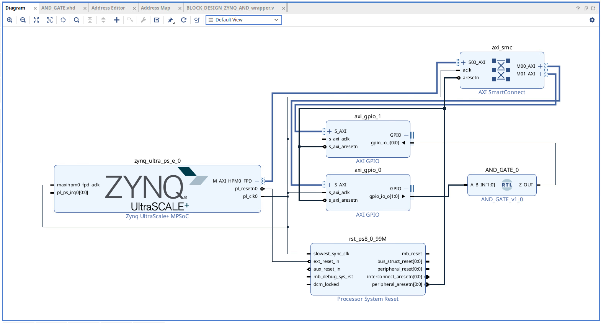

**Generación de la imagen de arranque en Vitis**: Platform (desde el `.xsa` de Vivado) → aplicación
FSBL (`zynqmp_fsbl_proyect.elf`) → generador de imágenes con componentes en orden:

1. `zynqmp_fsbl_proyect.elf` — modo bootloader, destino a53-0, EL3.
2. `pmufw.elf` — modo pmufw_image, destino a53-0 (firmware de gestión de potencia, del repo
   prebuilt-firmware de AMD para ZCU102).
3. `BLOCK_DESIGN_ZYNQ_AND_wrapper.bit` — modo datafile, destino PL (bitstream de Vivado).
4. `bl31.elf` — modo datafile, destino a53-0, EL3 (ARM Trusted Firmware).
5. `u-boot.elf` — modo datafile, destino a53-0, EL2 (gestor de arranque de 2ª etapa, carga
   `rtems.img`).
6. `system.dtb` — modo datafile, destino a53-0, carga en `0x100000` (permite a BL31 localizar
   BL33/U-Boot).

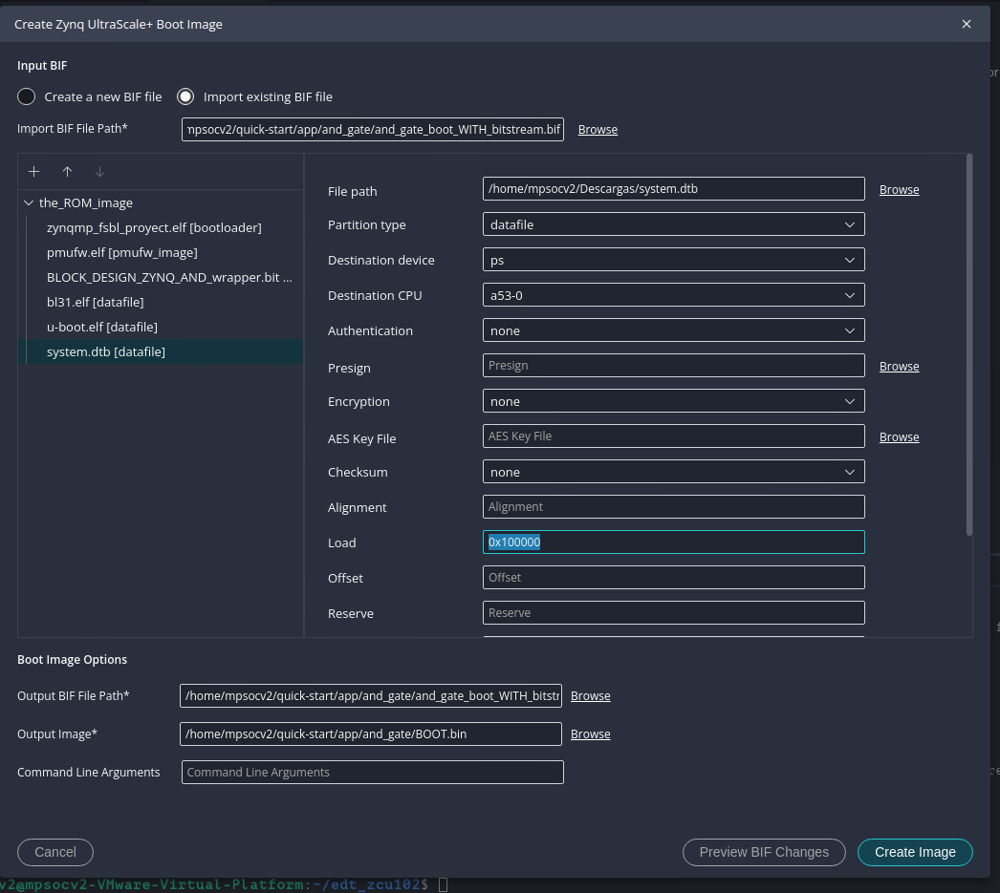

**Aplicación RTEMS**: `and_demo.c` (tarea `Init`: escribe (A,B) en `axi_gpio_0` @ `0xA0000000`, lee
Z de `axi_gpio_1` @ `0xA0010000`, imprime); `mmu_pl_map.c` (declara `0xA0000000`–`0xA01FFFFF` como
memoria de periférico al arrancar `Init`).

`BOOT.BIN` + `rtems.img` en la partición FAT de la SD, zócalo `J100`. Selector de arranque `SW6`
(ref. 44 del plano de componentes):

| Modo de arranque | PS_MODE[3:0] | SW6 [4:1] |
|---|---|---|
| JTAG | 0000 | ON, ON, ON, ON |
| QSPI32 (por defecto) | 0010 | ON, ON, OFF, ON |
| **Tarjeta SD** | 1110 | **OFF, OFF, OFF, ON** |

**Barrido de la tabla de verdad**:

```
## Transferring control to RTEMS (at address 000100000) ...
Barrido AND via PL
A=0, B=0, Z=0 (raw=0x00000000)
A=0, B=1, Z=0 (raw=0x00000000)
A=1, B=0, Z=0 (raw=0x00000000)
A=1, B=1, Z=1 (raw=0x00000001)

[ RTEMS shutdown ]
```

## C.9 Volcados completos de terminal — pruebas serie RS422/RS485

### Placa CDHS (3 transceptores)

```
MMU_MAP: return from mmu_map_pl_axi_early()
[TRANSCEIVER DEBUG] Detectados: 3 | Base: 0xA0000000 | INT: 0xA0003000
[TRANSCEIVER DEBUG]   - Transceptor 0: 0xA0000000
[TRANSCEIVER DEBUG]   - Transceptor 1: 0xA0001000
[TRANSCEIVER DEBUG]   - Transceptor 2: 0xA0002000

=== ARRANQUE SISTEMA ZCU102 (5 UARTs) ===
UART 00 [OK] Base: 0xA0000000
UART 01 [OK] Base: 0xA0001000
UART 02 [OK] Base: 0xA0002000
[RX UART 00]: UART 2 Lista.

CMD>
---- Sent utf8 encoded message: "0 hola" ----
0 hola
Tx -> UART 0: OK
CMD> [RX UART 02]: hola
---- Sent utf8 encoded message: "2 hola" ----
2 hola
Tx -> UART 2: OK
CMD> [RX UART 00]: hola
(... intercambios adicionales UART0<->UART2, con "?hola" en varias recepciones —
caracteres corruptos de una iteración previa al fix de start-bit ...)
---- Sent utf8 encoded message: "0 HOLA MUNDO" ----
0 HOLA MUNDO
Tx -> UART 0: OK
CMD> [RX UART 02]: HOLA MUNDO
---- Sent utf8 encoded message: "1 HOLA MUNDO" ----
1 HOLA MUNDO
Tx -> UART 1: OK
CMD>
---- Sent utf8 encoded message: "2 HOLA MUNDO" ----
2 HOLA MUNDO
Tx -> UART 2: OK
CMD> [RX UART 00]: HOLA MUNDO
```

(El encabezado `(5 UARTs)` es una cadena fija heredada de la campaña AOCS, no actualizada al
recompilar — los canales realmente activos son los 3 que reporta el descubrimiento dinámico.
Volcado íntegro en `tfm/00_docs/logs_terminal/cdhs_testing_rs`.)

### Placa AOCS (5 transceptores)

```
MMU_MAP: return from mmu_map_pl_axi_early()
[TRANSCEIVER DEBUG] Detectados: 5 | Base: 0xA0000000 | INT: 0xA0005000
[TRANSCEIVER DEBUG]   - Transceptor 0: 0xA0000000
[TRANSCEIVER DEBUG]   - Transceptor 1: 0xA0001000
[TRANSCEIVER DEBUG]   - Transceptor 2: 0xA0002000
[TRANSCEIVER DEBUG]   - Transceptor 3: 0xA0003000
[TRANSCEIVER DEBUG]   - Transceptor 4: 0xA0004000

=== ARRANQUE SISTEMA ZCU102 (5 UARTs) ===
UART 00 [OK] Base: 0xA0000000
UART 01 [OK] Base: 0xA0001000
UART 02 [OK] Base: 0xA0002000
UART 03 [OK] Base: 0xA0003000
UART 04 [OK] Base: 0xA0004000
[RX UART 00]: UART 4 Lista.

CMD>
---- Sent utf8 encoded message: "0 HOLA" ----
0 HOLA
Tx -> UART 0: OK
CMD> [RX UART 04]: HOLA
---- Sent utf8 encoded message: "4 HOLA" ----
4 HOLA
Tx -> UART 4: OK
CMD> [RX UART 00]: HOLA
---- Sent utf8 encoded message: "0 HOLA" ----
0 HOLA
Tx -> UART 0: OK
CMD> [RX UART 03]: HOLA
---- Sent utf8 encoded message: "3 HOLA" ----
3 HOLA
Tx -> UART 3: OK
CMD> [RX UART 00]: HOLA
---- Sent utf8 encoded message: "0 HOLA" ----
0 HOLA
Tx -> UART 0: OK
CMD> [RX UART 02]: HOLA
---- Sent utf8 encoded message: "2 HOLA" ----
2 HOLA
Tx -> UART 2: OK
CMD> [RX UART 00]: HOLA
---- Sent utf8 encoded message: "0 HOLA" ----
0 HOLA
Tx -> UART 0: OK
CMD> [RX UART 01]: HOLA
---- Sent utf8 encoded message: "1 HOLA" ----
1 HOLA
Tx -> UART 1: OK
CMD> [RX UART 00]: HOLA
```

(Sin caracteres corruptos — ya con el fix de start-bit incorporado. Volcado íntegro en
`tfm/00_docs/logs_terminal/aocs_testing_rs.txt`.)

## C.10 Volcado completo del barrido del ADC (CH2, placa CDHS)

```
ADS7950: CH0= 244  CH1=  43  CH2=   0  CH3=  19
ADS7950: CH0= 243  CH1=  43  CH2=   0  CH3=  19
ADS7950: CH0= 244  CH1=  43  CH2=   0  CH3=  19
ADS7950: CH0= 245  CH1=  43  CH2=   0  CH3=  19
ADS7950: CH0= 244  CH1=  43  CH2=   0  CH3=  19
ADS7950: CH0= 245  CH1=  44  CH2=   0  CH3=  19
ADS7950: CH0= 244  CH1=  43  CH2=1577  CH3=  19
ADS7950: CH0= 245  CH1=  43  CH2=1577  CH3=  19
ADS7950: CH0= 244  CH1=  43  CH2=1579  CH3=  19
ADS7950: CH0= 245  CH1=  43  CH2=1582  CH3=  19
ADS7950: CH0= 245  CH1=  43  CH2=1580  CH3=  20
ADS7950: CH0= 245  CH1=  43  CH2=1827  CH3=  19
ADS7950: CH0= 245  CH1=  43  CH2=2156  CH3=  20
ADS7950: CH0= 245  CH1=  44  CH2=2501  CH3=  20
ADS7950: CH0= 245  CH1=  43  CH2=2814  CH3=  20
ADS7950: CH0= 246  CH1=  43  CH2=2934  CH3=  21
ADS7950: CH0= 245  CH1=  43  CH2=3419  CH3=  21
ADS7950: CH0= 245  CH1=  43  CH2=3565  CH3=  21
ADS7950: CH0= 245  CH1=  43  CH2=3535  CH3=  22
ADS7950: CH0= 245  CH1=  43  CH2=3536  CH3=  22
ADS7950: CH0= 246  CH1=  43  CH2=3069  CH3=  22
ADS7950: CH0= 246  CH1=  43  CH2=2770  CH3=  22
ADS7950: CH0= 246  CH1=  43  CH2=2436  CH3=  22
ADS7950: CH0= 247  CH1=  43  CH2=1896  CH3=  22
ADS7950: CH0= 246  CH1=  43  CH2=1509  CH3=  22
ADS7950: CH0= 246  CH1=  43  CH2=1276  CH3=  22
ADS7950: CH0= 247  CH1=  43  CH2= 928  CH3=  22
ADS7950: CH0= 246  CH1=  43  CH2= 433  CH3=  22
ADS7950: CH0= 247  CH1=  43  CH2= 400  CH3=  22
ADS7950: CH0= 247  CH1=  43  CH2= 583  CH3=  22
ADS7950: CH0= 246  CH1=  43  CH2=1238  CH3=  22
ADS7950: CH0= 247  CH1=  43  CH2=1808  CH3=  23
ADS7950: CH0= 247  CH1=  43  CH2=1827  CH3=  23
ADS7950: CH0= 247  CH1=  43  CH2=1826  CH3=  23
ADS7950: CH0= 248  CH1=  43  CH2= 647  CH3=  23
ADS7950: CH0= 248  CH1=  44  CH2= 245  CH3=  23
ADS7950: CH0= 248  CH1=  43  CH2= 189  CH3=  23
ADS7950: CH0= 248  CH1=  43  CH2= 166  CH3=  22
ADS7950: CH0= 247  CH1=  43  CH2= 148  CH3=  23
ADS7950: CH0= 248  CH1=  43  CH2= 130  CH3=  22
ADS7950: CH0= 248  CH1=  43  CH2= 116  CH3=  22
ADS7950: CH0= 248  CH1=  43  CH2= 102  CH3=  22
ADS7950: CH0= 248  CH1=  43  CH2=1823  CH3=  23
ADS7950: CH0= 247  CH1=  43  CH2=1821  CH3=  23
ADS7950: CH0= 248  CH1=  43  CH2=1820  CH3=  23
ADS7950: CH0= 248  CH1=  43  CH2=1825  CH3=  23
ADS7950: CH0= 248  CH1=  43  CH2=1826  CH3=  23
ADS7950: CH0= 250  CH1=  43  CH2=1826  CH3=  23
ADS7950: CH0= 249  CH1=  43  CH2=1826  CH3=  23
ADS7950: CH0= 249  CH1=  44  CH2=1827  CH3=  23
ADS7950: CH0= 249  CH1=  43  CH2=1825  CH3=  23
ADS7950: CH0= 249  CH1=  43  CH2=1826  CH3=  24
ADS7950: CH0= 248  CH1=  43  CH2=1820  CH3=  24
ADS7950: CH0= 249  CH1=  43  CH2= 390  CH3=  23
ADS7950: CH0= 249  CH1=  43  CH2= 230  CH3=  23
ADS7950: CH0= 250  CH1=  43  CH2= 189  CH3=  23
```

(Se aprecian dos tramos de subida/bajada de la rampa aplicada a CH2, dos escalones intermedios con
la fuente fija, y estabilidad de CH0/CH1/CH3 durante todo el ensayo. Volcado en
`tfm/00_docs/logs_terminal/cdhs_testing_adc.txt`.)

---

## Referencias citadas en el texto (claves de `biblio.bib`)

`indra2026lince`, `vita571fmc`, `xilinx2023ug1182`, `atlassian_jira`, `knaggs2010kanban`,
`arm2011axi4`, `xilinx2022pg021`, `xilinx2022pg288`, `mogul1997livelock`, `rtems_quickstart`,
`rtems_rsb`, `weicker1984dhrystone`, `repo_tfm`, `ti2014rs485`, `eia485a`, `ti2018rs422`, `tia422b`,
`ecss50spw`, `parkes2012spw`, `iso118981`, `esa2015can`, `pcbway_caps`, `ltc2865`, `ramos2026can`
(TFG de Diego Ramos, driver CANps y diseño del subsistema CAN de LINCE), `ti2018ads7950`,
`xilinx2023ug1085`, `ue2012weee`, `ue2011rohs`, `esa_environment_report`.
